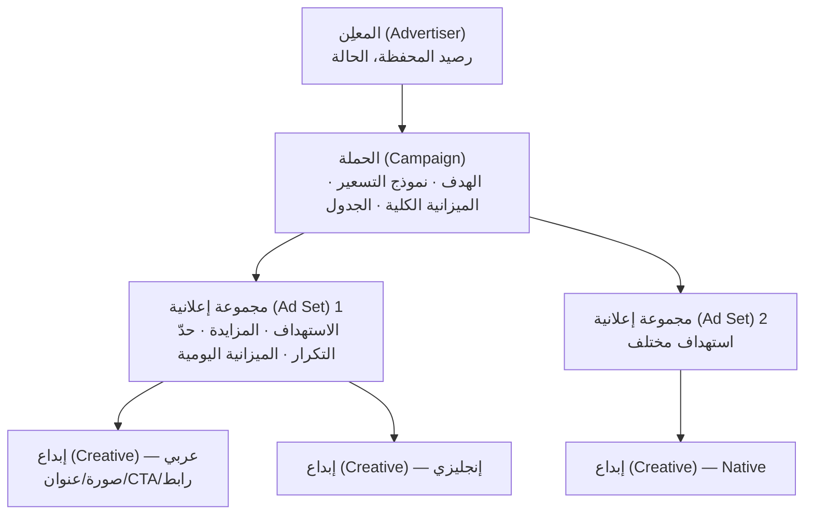
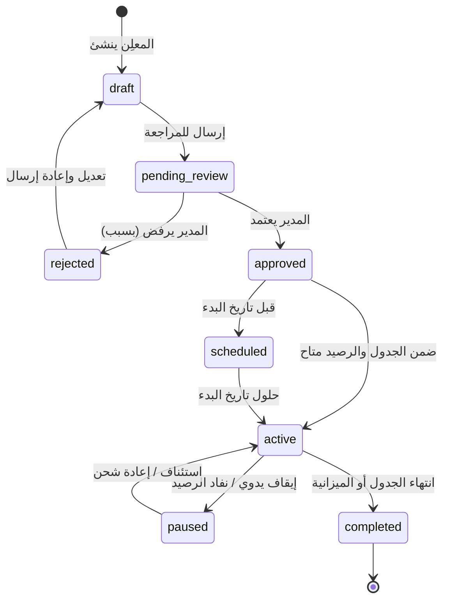
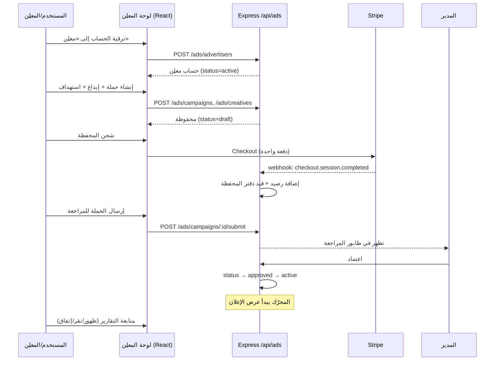
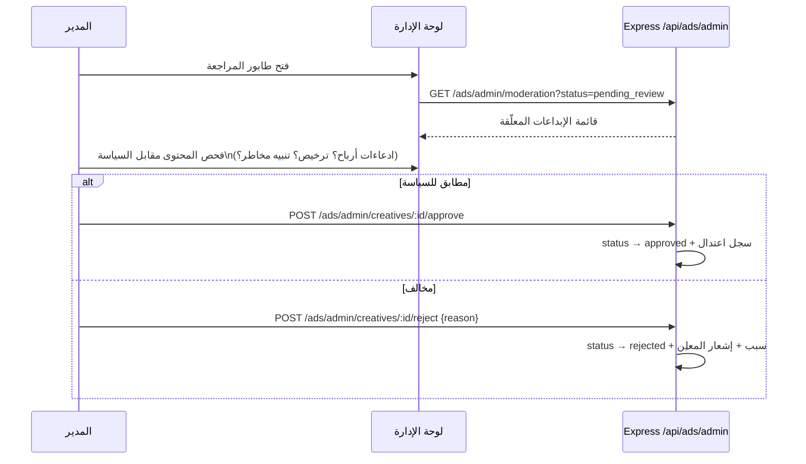
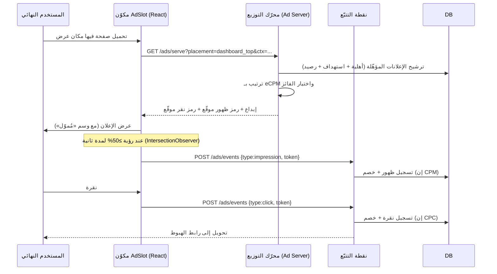

# 02 — الميزات وتدفّقات المستخدم (Features & User Flows)

> **المشروع:** نظام إعلانات تجارية مُدمَج في منصة TechPioneers / CopyTrade Pro
> **تاريخ الإصدار:** 2026-06-07
> **الإصدار:** 1.0
> **الحالة:** مسودة

---

## جدول المحتويات

1. [خريطة الميزات الكبرى](#1-feature-map)
2. [هيكل الحملة (Campaign Hierarchy)](#2-hierarchy)
3. [دورة حياة الإعلان (State Machine)](#3-lifecycle)
4. [تدفّقات المستخدم (User Flows)](#4-flows)
5. [أماكن العرض (Placements Catalog)](#5-placements)
6. [أنواع الإبداعات (Creative Types)](#6-creatives)
7. [واجهات التحكّم (Consoles)](#7-consoles)
8. [التعدّد اللغوي (i18n)](#8-i18n)

---

## 1. خريطة الميزات الكبرى {#1-feature-map}

تُقسَّم الميزات إلى خمسة محاور (مطابقة للمحاور التي طُرحت في تصوّر المشروع):

| المحور | الميزات | التفصيل في |
|---|---|---|
| **1. إدارة الإعلانات** | إنشاء/تحرير الحملات والإبداعات، الجدولة، التحكّم بالحالة، متابعة الأداء | هذه الوثيقة |
| **2. الاستهداف** | ديموغرافي (دولة/لغة/خطة)، سلوكي (استراتيجيات/مخاطرة/متابعات) | [04](./04-targeting-billing-and-analytics.md#1-targeting) |
| **3. الدفع والتسوية** | محفظة مسبقة الدفع، شحن Stripe، خصم الإنفاق، تقارير مالية | [04](./04-targeting-billing-and-analytics.md#3-billing) |
| **4. التقارير والتحليل** | مقاييس الأداء، لوحات، توصيات تحسين بالذكاء الاصطناعي | [04](./04-targeting-billing-and-analytics.md#5-analytics) |
| **5. واجهة المستخدم** | لوحة المعلِن، لوحة المدير، عرض الإعلان، تعدّد اللغات | هذه الوثيقة |

---

## 2. هيكل الحملة (Campaign Hierarchy) {#2-hierarchy}

يتبع النظام التسلسل القياسي ثلاثي المستويات (المعتمد في Google/Meta Ads) لفصل المسؤوليات:



| المستوى | المسؤولية | أمثلة الحقول |
|---|---|---|
| **Campaign** | «لماذا» — الهدف والميزانية الكلية | objective, pricing_model, total_budget, start/end |
| **Ad Set** | «لمن» — الاستهداف والمزايدة | targeting (JSON), bid_amount, daily_budget, frequency_cap |
| **Creative** | «ماذا» — المحتوى المعروض | format, headline, body, image_url, cta_label, landing_url, locale |

> **تبسيط MVP:** يمكن في النسخة الأولى دمج مستوى Ad Set داخل الحملة (حملة = استهداف + مزايدة واحدة)
> لتقليل التعقيد، مع الإبقاء على البنية الجدولية قابلةً للتوسّع لاحقاً.

---

## 3. دورة حياة الإعلان (State Machine) {#3-lifecycle}



**محفّزات الانتقال الآلي:**
- `active → paused`: نفاد رصيد المحفظة، أو بلوغ الميزانية اليومية، أو إيقاف يدوي.
- `paused → active`: إعادة شحن المحفظة أو بداية يوم جديد (تصفير الميزانية اليومية).
- `active → completed`: تجاوز `end_at` أو استنفاد `total_budget`.

---

## 4. تدفّقات المستخدم (User Flows) {#4-flows}

### 4.1 رحلة المعلِن (Advertiser Journey)



### 4.2 مراجعة واعتماد المدير (Moderation)



### 4.3 عرض الإعلان للمستخدم النهائي (Ad Delivery)



---

## 5. أماكن العرض (Placements Catalog) {#5-placements}

كل مكان عرض هو «فتحة» (Slot) مُعرّفة في النظام، مربوطة بمكوّن واجهة فعلي:

| مفتاح المكان (`slot_key`) | الموضع | الصيغة | المكوّن الحالي | السعر الأرضي |
|---|---|---|---|---|
| `dashboard_top_banner` | أعلى لوحة التحكّم | بانر عريض (Leaderboard) | `pages/Dashboard.tsx` | متوسط |
| `traders_native_card` | ضمن قائمة المتداولين (كل N بطاقات) | بطاقة أصيلة (Native) | `pages/TradersPage.tsx` | مرتفع (صلة عالية) |
| `trader_profile_sidebar` | جانب صفحة ملف المتداول | بانر جانبي (Skyscraper) | `pages/TraderProfilePage.tsx` | متوسط |
| `sidebar_promo` | أسفل شريط التنقّل | بطاقة ترويجية صغيرة | `components/Nav.tsx` | منخفض |
| `interstitial` (لاحقاً) | فاصل بين الإجراءات | شاشة كاملة (محدود جداً) | — | مرتفع |

**قواعد الكثافة (Density Rules):**
- حدّ أقصى **مكان عرض واحد مرئي** في الشاشة الواحدة على الجوال.
- `traders_native_card`: إعلان واحد لكل 6 بطاقات على الأقل.
- لا `interstitial` أثناء تدفّقات النسخ/الدفع.
- مستخدمو `pro`: كثافة مخفّضة أو صفرية (قابل للتهيئة).

---

## 6. أنواع الإبداعات (Creative Types) {#6-creatives}

| النوع | المكوّنات | الاستخدام |
|---|---|---|
| **بانر صورة (Image Banner)** | صورة + رابط هبوط | حملات العلامة، أماكن البانر |
| **بطاقة أصيلة (Native Card)** | شعار + عنوان + نص قصير + CTA + رابط | الاندماج ضمن قائمة المتداولين |
| **متداول مُموّل (Sponsored Trader)** — لاحقاً | بطاقة متداول حقيقية موسومة «مُموّل» | الترويج لملفات المتداولين |
| **نص + CTA (Text Ad)** | عنوان + سطر + زر | أماكن منخفضة الارتفاع |

**النسخ متعدّدة اللغات:** لكل إبداع نسخة لكل `locale` مدعوم؛ يختار المحرّك النسخة المطابقة للغة
واجهة المستخدم، ويرجع للإنجليزية كنسخة افتراضية عند غياب الترجمة.

---

## 7. واجهات التحكّم (Consoles) {#7-consoles}

### 7.1 لوحة المعلِن (Advertiser Console)

صفحات داخل التطبيق (تُضاف كصفحات جديدة في نظام التنقّل الحالي القائم على `useState`):

| الصفحة | الوظيفة |
|---|---|
| **الحملات (Campaigns)** | قائمة الحملات وحالاتها ومؤشّراتها السريعة |
| **منشئ الحملة (Builder)** | معالج: الهدف ← الاستهداف ← الميزانية/الجدول ← الإبداعات ← مراجعة |
| **الإبداعات (Creatives)** | إدارة الإبداعات والنسخ اللغوية ومعاينة العرض |
| **المحفظة والفوترة (Billing)** | الرصيد، شحن، كشف حساب، الإيصالات |
| **التقارير (Reports)** | لوحات الأداء (ظهور/نقر/CTR/إنفاق/CPC) + تصدير CSV |

### 7.2 لوحة المدير (Admin Console)

| الصفحة | الوظيفة |
|---|---|
| **طابور المراجعة (Moderation)** | اعتماد/رفض الإبداعات مع الأسباب وسجلّ القرارات |
| **المعلنون (Advertisers)** | إدارة حسابات المعلنين وحالاتهم |
| **السياسة (Policy)** | قواعد المحتوى والفئات المحظورة/المقيّدة |
| **أماكن العرض (Placements)** | تفعيل/تعطيل الفتحات وضبط الأسعار الأرضية وقواعد الكثافة |
| **لوحة الدخل (Revenue)** | الإيراد، eCPM، معدّل الملء، أفضل المعلنين والأماكن |

> ملاحظة تكامل: نظام التنقّل الحالي في `client/src/App.tsx` و`components/Nav.tsx` يعتمد نوعاً
> `Page` ثابتاً. تُوسَّع هذه القائمة بعناصر مشروطة بالدور (`advertiser` / `admin`) — انظر
> [03 §8](./03-technical-architecture.md#8-frontend).

---

## 8. التعدّد اللغوي (i18n) {#8-i18n}

- **محتوى الإعلانات:** يُخزَّن لكل لغة (حقل `locale` على الإبداع).
- **نصوص الواجهة:** تُضاف مفاتيح جديدة إلى نظام i18n الحالي (`client/src/i18n.ts`) ضمن نطاق `ads*`
  لجميع اللغات الثماني المدعومة (en, ar, fr, es, tr, de, zh, he)، مع احترام اتجاه RTL القائم
  للعربية والعبرية.

أمثلة على المفاتيح المقترحة:

```ts
// إضافات مقترحة إلى كائن الترجمة في i18n.ts
adsConsole: "لوحة الإعلانات",
adsCampaigns: "الحملات",
adsCreateCampaign: "إنشاء حملة",
adsWallet: "المحفظة",
adsTopUp: "شحن الرصيد",
adsTargeting: "الاستهداف",
adsSponsoredLabel: "مُموّل",
adsImpressions: "الظهور",
adsClicks: "النقرات",
adsSpend: "الإنفاق",
```

---

*التالي: [03 — المعمارية التقنية](./03-technical-architecture.md)*
