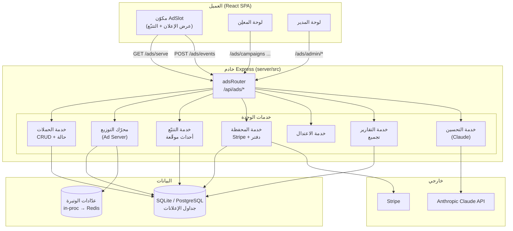
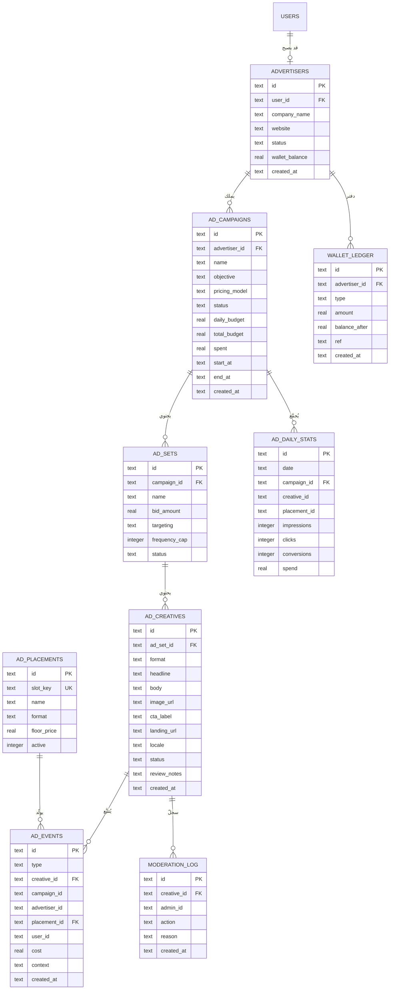
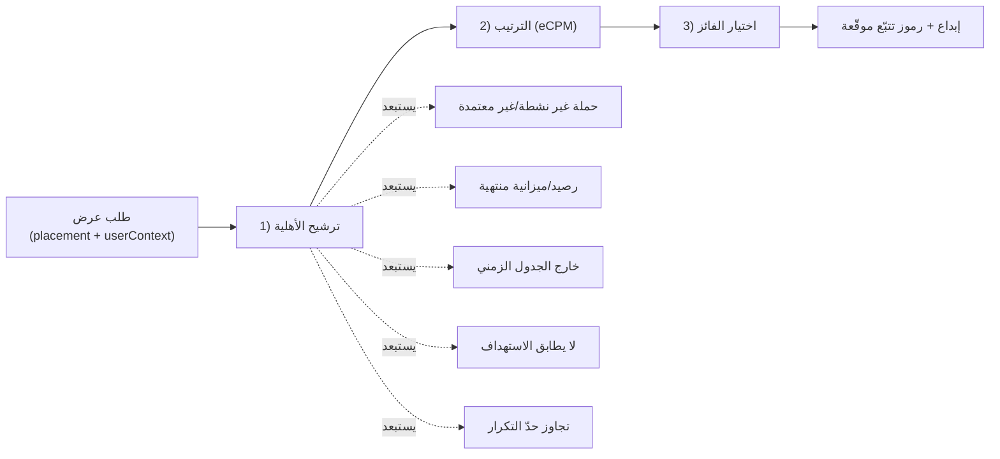

# 03 — المعمارية التقنية (Technical Architecture)

> **المشروع:** نظام إعلانات تجارية مُدمَج في منصة TechPioneers / CopyTrade Pro
> **تاريخ الإصدار:** 2026-06-07
> **الإصدار:** 1.0
> **الحالة:** مسودة

---

## جدول المحتويات

1. [المبادئ والتكامل مع المنصة القائمة](#1-principles)
2. [مكدّس التقنيات](#2-stack)
3. [النظرة المعمارية العليا](#3-overview)
4. [نموذج البيانات (Data Model / ERD)](#4-data-model)
5. [محرّك التوزيع (Ad Delivery Engine)](#5-delivery)
6. [تصميم الـ API](#6-api)
7. [المصادقة والأدوار (Auth & Roles)](#7-auth)
8. [التكامل مع الواجهة الأمامية](#8-frontend)
9. [مسار التطوّر وقابلية القياس](#9-evolution)

---

## 1. المبادئ والتكامل مع المنصة القائمة {#1-principles}

المبدأ الحاكم: **إعادة الاستخدام لا إعادة الاختراع**. وحدة الإعلانات تُبنى فوق ما هو قائم فعلاً في
المستودع، لا كنظام موازٍ:

| الأصل القائم | الموقع | كيف تستخدمه وحدة الإعلانات |
|---|---|---|
| خادم Express + موجّهات | `server/src/index.ts`, `server/src/routes/*` | موجّه جديد `adsRouter` يُسجَّل بـ `app.use("/api/ads", adsRouter)` |
| قاعدة SQLite | `server/src/db.ts` (better-sqlite3) | جداول إعلانات جديدة في نفس قاعدة البيانات |
| مصادقة JWT | `server/src/middleware/auth.ts` | يُعاد استخدام `requireAuth` + middleware جديد `requireRole` |
| تكامل Stripe | `server/src/routes/subscriptions.ts` | يُعاد استخدام نمط Checkout/Webhook لشحن المحفظة |
| واجهة React + i18n | `client/src/*` | صفحات ومكوّنات جديدة + مفاتيح ترجمة ضمن `i18n.ts` |
| التنقّل (state-based) | `client/src/App.tsx`, `components/Nav.tsx` | توسيع نوع `Page` بعناصر مشروطة بالدور |

> **قاعدة العزل (Fail-Safe):** فشل أي مكوّن في وحدة الإعلانات (محرّك، تتبّع، تقارير) **لا يجوز** أن
> يُعطّل المسارات الأساسية للمنصة. مكان العرض ببساطة يعود فارغاً.

---

## 2. مكدّس التقنيات {#2-stack}

في تصوّر المشروع طُرحت خيارات (React/Vue، Node/Django، MySQL/PostgreSQL). بما أن القرار «وحدة مدمجة»،
نلتزم بمكدّس المنصة الحالي ونوضّح المبرّر:

| الطبقة | الخيار المعتمد | الخيار المطروح والمرفوض | المبرّر |
|---|---|---|---|
| الواجهة | **React + Vite + TypeScript + Tailwind** | Vue.js | هو مكدّس المنصة الحالي بالفعل |
| الخادم | **Node.js + Express + TypeScript** | Python/Django | لا داعي لمكدّس ثانٍ؛ مشاركة الأنواع مع الواجهة |
| قاعدة البيانات | **SQLite الآن → PostgreSQL عند الحجم** | MySQL | البدء بما هو قائم؛ Postgres يوفّر JSONB وفهارس أقوى عند ارتفاع حجم الأحداث |
| العدّادات/الوتيرة | **داخل العملية الآن → Redis لاحقاً** | — | تبسيط MVP، ترقية عند الحاجة للتوزيع |
| الدفع | **Stripe** (قائم) | — | مُدمج بالفعل في المنصة |
| التحليلات | **أحداث داخلية + تجميع دوري** (اختيارياً GA لاحقاً) | الاعتماد الكامل على أداة خارجية | ملكية البيانات والدقّة وعدم تسريب بيانات شخصية |
| الذكاء الاصطناعي | **Claude (Haiku/Sonnet)** | — | اتساقاً مع توجّه وثائق الـ CRM في المنصة |

---

## 3. النظرة المعمارية العليا {#3-overview}



---

## 4. نموذج البيانات (Data Model / ERD) {#4-data-model}

### 4.1 المخطّط العلائقي

يتبع النموذج أعراف قاعدة البيانات الحالية: مفاتيح `TEXT` (UUID)، تسمية `snake_case`، طوابع زمنية
`TEXT` بصيغة ISO، ومفاتيح أجنبية مع `ON DELETE CASCADE` (كما في `server/src/db.ts`).



### 4.2 مثال DDL (بأسلوب `db.ts` الحالي)

```ts
// server/src/ads/schema.ts — يُستدعى بعد تهيئة db
db.exec(`
  CREATE TABLE IF NOT EXISTS advertisers (
    id TEXT PRIMARY KEY,
    user_id TEXT NOT NULL UNIQUE,
    company_name TEXT NOT NULL,
    website TEXT,
    status TEXT NOT NULL DEFAULT 'active',     -- active | suspended
    wallet_balance REAL NOT NULL DEFAULT 0,
    created_at TEXT NOT NULL,
    FOREIGN KEY (user_id) REFERENCES users(id) ON DELETE CASCADE
  )
`);

db.exec(`
  CREATE TABLE IF NOT EXISTS ad_campaigns (
    id TEXT PRIMARY KEY,
    advertiser_id TEXT NOT NULL,
    name TEXT NOT NULL,
    objective TEXT NOT NULL DEFAULT 'traffic',      -- awareness | traffic | conversions
    pricing_model TEXT NOT NULL DEFAULT 'cpc',       -- cpc | cpm | cpa
    status TEXT NOT NULL DEFAULT 'draft',            -- draft|pending_review|approved|active|paused|completed|rejected
    daily_budget REAL NOT NULL DEFAULT 0,
    total_budget REAL NOT NULL DEFAULT 0,
    spent REAL NOT NULL DEFAULT 0,
    start_at TEXT,
    end_at TEXT,
    created_at TEXT NOT NULL,
    FOREIGN KEY (advertiser_id) REFERENCES advertisers(id) ON DELETE CASCADE
  )
`);

db.exec(`
  CREATE TABLE IF NOT EXISTS ad_events (
    id TEXT PRIMARY KEY,
    type TEXT NOT NULL,                  -- impression | click | conversion
    creative_id TEXT NOT NULL,
    campaign_id TEXT NOT NULL,
    advertiser_id TEXT NOT NULL,
    placement_id TEXT NOT NULL,
    user_id TEXT,
    cost REAL NOT NULL DEFAULT 0,
    context TEXT,                        -- JSON: { locale, plan, country, ... }
    created_at TEXT NOT NULL
  )
`);

// فهارس حرجة لأداء التقارير والتوزيع
db.exec(`CREATE INDEX IF NOT EXISTS idx_events_campaign_date ON ad_events (campaign_id, created_at)`);
db.exec(`CREATE INDEX IF NOT EXISTS idx_events_type_date     ON ad_events (type, created_at)`);
db.exec(`CREATE INDEX IF NOT EXISTS idx_campaigns_status     ON ad_campaigns (status)`);
db.exec(`CREATE UNIQUE INDEX IF NOT EXISTS idx_daily_stats   ON ad_daily_stats (date, campaign_id, creative_id, placement_id)`);
```

> **ملاحظة على `ad_events`:** جدول إلحاقي (Append-only) عالي الحجم. في SQLite يُكتب بكفاءة عبر
> معاملات مُجمّعة، لكنه أوّل مرشّح للهجرة إلى PostgreSQL مع تقسيم زمني (Partitioning) عند الحجم.

---

## 5. محرّك التوزيع (Ad Delivery Engine) {#5-delivery}

القلب التشغيلي للنظام. لكل طلب عرض، يمرّ بثلاث مراحل: **ترشيح الأهلية ← الترتيب ← الاختيار**.



### 5.1 منطق الاختيار (Pseudocode)

```ts
// server/src/ads/delivery.ts
interface UserContext {
  userId?: string;
  locale: string;       // من واجهة i18n
  plan: "free" | "pro";
  country?: string;
  interests: string[];  // مشتقّة من السلوك: استراتيجيات/مستوى مخاطرة متابَع
}

async function serveAd(placementKey: string, ctx: UserContext): Promise<ServedAd | null> {
  const placement = getActivePlacement(placementKey);
  if (!placement) return null;

  // 1) الأهلية
  const candidates = getEligibleCreatives({
    format: placement.format,
    now: new Date(),
  }).filter((c) =>
    c.campaign.status === "active" &&
    c.campaign.spent < c.campaign.total_budget &&
    dailySpend(c.campaign) < c.campaign.daily_budget &&
    withinSchedule(c.campaign) &&
    matchesTargeting(c.adSet.targeting, ctx) &&        // انظر الوثيقة 04
    underFrequencyCap(c.adSet, ctx.userId)
  );
  if (candidates.length === 0) return null;            // معدّل ملء: لا إعلان

  // 2) الترتيب: توحيد كل النماذج إلى eCPM
  const ranked = candidates
    .map((c) => ({ c, ecpm: effectiveCpm(c, ctx) }))
    .sort((a, b) => b.ecpm - a.ecpm);

  // 3) الاختيار (MVP: الأعلى eCPM فوق السعر الأرضي)
  const winner = ranked.find((r) => r.ecpm >= placement.floor_price);
  if (!winner) return null;

  return {
    creative: pickLocale(winner.c, ctx.locale),
    impressionToken: signToken({ creativeId: winner.c.id, placement: placementKey, ctx, t: Date.now() }),
    clickToken: signToken({ creativeId: winner.c.id, placement: placementKey, kind: "click", t: Date.now() }),
  };
}

// توحيد التسعير: CPM = المزايدة مباشرة؛ CPC = bid × pCTR متوقّع × 1000
function effectiveCpm(c: Candidate, ctx: UserContext): number {
  if (c.campaign.pricing_model === "cpm") return c.adSet.bid_amount;
  const pCTR = predictedCtr(c, ctx);                  // MVP: ثابت/تاريخي؛ لاحقاً نموذج
  return c.adSet.bid_amount * pCTR * 1000;
}
```

### 5.2 الوتيرة وحدّ التكرار (Pacing & Frequency Capping)

- **الوتيرة (Pacing):** توزيع الميزانية اليومية عبر اليوم بدل استهلاكها دفعة واحدة (احتساب معدّل
  مستهدف للإنفاق بالساعة). في MVP يكفي «إيقاف عند بلوغ الميزانية اليومية».
- **حدّ التكرار (Frequency Cap):** عدّاد لكل (مستخدم × إبداع × نافذة زمنية) لمنع تكرار الإعلان نفسه.
  يُخزَّن في عدّاد داخل العملية الآن، ويُرحَّل إلى Redis عند الحاجة للتوزيع متعدّد العمليات.

### 5.3 ميزانية زمن الاستجابة (Latency Budget)

| المرحلة | الحدّ المستهدف |
|---|---|
| `GET /ads/serve` (P95) | < 50ms |
| ترشيح الأهلية | يعتمد على مجموعة مرشّحين مُحمّلة/مُخزّنة مؤقّتاً (لا مسح كامل لكل طلب) |
| كتابة الحدث | غير حاجبة للعرض (Fire-and-forget من العميل) |

---

## 6. تصميم الـ API {#6-api}

كل المسارات تحت `/api/ads`. العمود «الدور» يشير إلى أدنى صلاحية مطلوبة.

| الطريقة | المسار | الدور | الوصف |
|---|---|---|---|
| POST | `/ads/advertisers` | user | ترقية المستخدم إلى معلِن |
| GET | `/ads/advertisers/me` | advertiser | بيانات المعلِن ورصيد المحفظة |
| POST | `/ads/campaigns` | advertiser | إنشاء حملة (draft) |
| GET | `/ads/campaigns` | advertiser | حملات المعلِن (مقيّدة بـ advertiser_id) |
| PATCH | `/ads/campaigns/:id` | advertiser | تحرير/إيقاف/استئناف |
| POST | `/ads/campaigns/:id/submit` | advertiser | إرسال للمراجعة (→ pending_review) |
| POST | `/ads/creatives` | advertiser | إنشاء إبداع (بنسخة لغوية) |
| GET | `/ads/reports?campaign_id=` | advertiser | تقارير الأداء |
| POST | `/ads/wallet/topup` | advertiser | إنشاء جلسة Stripe لشحن الرصيد |
| POST | `/ads/wallet/webhook` | — (توقيع Stripe) | إضافة الرصيد بعد نجاح الدفع |
| **GET** | `/ads/serve` | عام/اختياري | طلب إعلان لمكان عرض (مسار التوزيع) |
| **POST** | `/ads/events` | عام (رمز موقّع) | تسجيل ظهور/نقر/تحويل |
| GET | `/ads/admin/moderation` | admin | طابور المراجعة |
| POST | `/ads/admin/creatives/:id/approve` | admin | اعتماد |
| POST | `/ads/admin/creatives/:id/reject` | admin | رفض مع سبب |
| GET | `/ads/admin/revenue` | admin | لوحة الدخل ومعدّل الملء |
| GET/PUT | `/ads/admin/placements` | admin | إدارة أماكن العرض والأسعار الأرضية |

**مبادئ التصميم:**
- **عزل المُلكية:** كل قراءة/كتابة للمعلِن مقيّدة بـ `advertiser_id` المستخرج من رمز JWT، لا من جسم الطلب.
- **عدم الثقة بالعميل:** تكلفة الحدث (`cost`) تُحسب في الخادم من بيانات الحملة، لا تُرسل من العميل أبداً.
- **التحقّق من المدخلات:** كل نقطة دخول تتحقّق من النوع والمدى (روابط الهبوط، الميزانيات، الاستهداف).

---

## 7. المصادقة والأدوار (Auth & Roles) {#7-auth}

النظام الحالي يحمل في رمز JWT الحقول `{ id, email, plan }` فقط، **بلا أدوار**. وحدة الإعلانات تتطلّب
تمييز ثلاثة أدوار، لذا نضيف بعداً جديداً دون كسر ما هو قائم:

### 7.1 التغيير على البيانات والرمز

```sql
-- ترقية بسيطة: عمود دور على المستخدمين
ALTER TABLE users ADD COLUMN role TEXT NOT NULL DEFAULT 'user';  -- user | advertiser | admin
```

```ts
// توسيع حمولة JWT (auth.ts و routes/auth.ts)
interface JwtPayload {
  id: string;
  email: string;
  plan: string;
  role: "user" | "advertiser" | "admin";   // جديد
}
```

### 7.2 middleware للأدوار

```ts
// server/src/middleware/requireRole.ts
import { Response, NextFunction } from "express";
import { AuthRequest } from "./auth";

export const requireRole = (...roles: string[]) =>
  (req: AuthRequest, res: Response, next: NextFunction): void => {
    if (!req.user) { res.status(401).json({ error: "Unauthorized" }); return; }
    if (!roles.includes((req.user as any).role)) {
      res.status(403).json({ error: "Forbidden: insufficient role" });
      return;
    }
    next();
  };

// الاستخدام: router.get("/admin/revenue", requireAuth, requireRole("admin"), handler)
```

> **ملاحظة توافق:** الحقل `role` افتراضه `'user'`، لذا كل المستخدمين الحاليين يبقون كما هم. ترقية
> المستخدم إلى `advertiser` تحدث عند إنشاء حساب معلِن؛ ودور `admin` يُمنح يدوياً لفريق العمليات.

---

## 8. التكامل مع الواجهة الأمامية {#8-frontend}

### 8.1 التنقّل المشروط بالدور

نظام التنقّل الحالي في `App.tsx` يستخدم `useState<Page>`. نوسّع نوع `Page` ونضيف عناصر مشروطة:

```ts
type Page =
  | "dashboard" | "traders" | "my-copies" | "settings" | "mt-connect"
  | "ads-campaigns" | "ads-wallet" | "ads-reports"   // للمعلِن
  | "ads-admin";                                       // للمدير

// في Nav.tsx: تُعرض عناصر الإعلانات فقط حسب user.role
```

### 8.2 مكوّن عرض الإعلان `AdSlot`

```tsx
// client/src/components/ads/AdSlot.tsx
import { useEffect, useRef, useState } from "react";
import { useLang } from "../../LanguageContext";
import { useAuth } from "../../contexts/AuthContext";

export function AdSlot({ placement }: { placement: string }) {
  const { lang } = useLang();
  const { user } = useAuth();
  const [ad, setAd] = useState<ServedAd | null>(null);
  const ref = useRef<HTMLDivElement>(null);
  const seen = useRef(false);

  useEffect(() => {
    fetch(`/api/ads/serve?placement=${placement}&locale=${lang}&plan=${user?.plan ?? "free"}`)
      .then((r) => (r.ok ? r.json() : null))
      .then(setAd)
      .catch(() => setAd(null));        // فشل ⇒ فتحة فارغة (تدهور لطيف)
  }, [placement, lang]);

  // ظهور قابل للمشاهدة: ≥50% لمدة ثانية
  useEffect(() => {
    if (!ad || !ref.current) return;
    const io = new IntersectionObserver(([e]) => {
      if (e.isIntersecting && !seen.current) {
        seen.current = true;
        navigator.sendBeacon?.("/api/ads/events",
          JSON.stringify({ type: "impression", token: ad.impressionToken }));
      }
    }, { threshold: 0.5 });
    io.observe(ref.current);
    return () => io.disconnect();
  }, [ad]);

  if (!ad) return null;                 // لا إعلان ⇒ لا مساحة فارغة مزعجة

  const onClick = () => {
    fetch("/api/ads/events", { method: "POST",
      body: JSON.stringify({ type: "click", token: ad.clickToken }) });
    window.open(ad.creative.landing_url, "_blank", "noopener");
  };

  return (
    <div ref={ref} onClick={onClick} className="relative cursor-pointer ...">
      <span className="absolute top-1 end-1 text-[10px] text-slate-500">مُموّل</span>
      {/* عرض الإبداع حسب الصيغة */}
    </div>
  );
}
```

**الإدماج في الصفحات القائمة:** `<AdSlot placement="dashboard_top_banner" />` أعلى `Dashboard.tsx`،
و`<AdSlot placement="traders_native_card" />` ضمن شبكة `TradersPage.tsx` (كل 6 بطاقات).

---

## 9. مسار التطوّر وقابلية القياس {#9-evolution}

```
المرحلة 1 (MVP):
  ├── SQLite + جداول الإعلانات في نفس قاعدة البيانات
  ├── عدّادات وتيرة/تكرار داخل العملية
  ├── كتابة أحداث متزامنة (مع معاملات مُجمّعة)
  └── خدمات الإعلانات داخل خادم Express نفسه

المرحلة 2 (نمو الحجم):
  ├── هجرة ad_events إلى PostgreSQL (JSONB + تقسيم زمني)
  ├── Redis للعدّادات والوتيرة وحدّ التكرار
  ├── طابور لكتابة الأحداث (فصل مسار الكتابة الثقيل)
  └── تخزين كائنات (Object Storage) + CDN لصور الإبداعات

المرحلة 3 (توسّع):
  ├── فصل «محرّك التوزيع» كخدمة مستقلة منخفضة الكمون
  ├── ذاكرة تخزين مؤقّت للإعلانات المؤهّلة (Hot Set)
  └── مزاد تنافسي + تحسين آلي بالذكاء الاصطناعي
```

| البُعد | عنق الزجاجة المتوقّع | المعالجة |
|---|---|---|
| حجم `ad_events` | نمو سريع جداً | تجميع دوري (Rollup) + تقسيم + أرشفة |
| كمون `/ads/serve` | مسح المرشّحين | تحميل مسبق/تخزين مؤقّت لمجموعة الإعلانات النشطة |
| تزامن العدّادات | عمليات متعدّدة | الترقية إلى Redis (INCR ذرّي) |
| صور الإبداعات | حمل على الخادم | CDN + تخزين كائنات |

---

*التالي: [04 — الاستهداف والدفع والتحليلات](./04-targeting-billing-and-analytics.md)*
