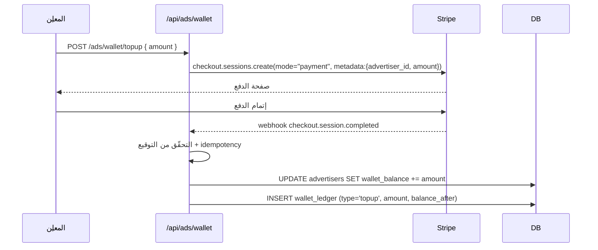
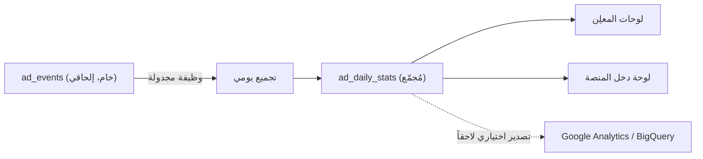

# 04 — الاستهداف والدفع والتحليلات (Targeting, Billing & Analytics)

> **المشروع:** نظام إعلانات تجارية مُدمَج في منصة TechPioneers / CopyTrade Pro
> **تاريخ الإصدار:** 2026-06-07
> **الإصدار:** 1.0
> **الحالة:** مسودة

---

## جدول المحتويات

1. [محرّك الاستهداف (Targeting)](#1-targeting)
2. [التسعير والمزاد (Pricing & Auction)](#2-pricing)
3. [الدفع والتسوية المالية (Billing & Settlement)](#3-billing)
4. [التتبّع ومكافحة الاحتيال (Tracking & IVT)](#4-tracking)
5. [التقارير والتحليلات (Analytics)](#5-analytics)
6. [التحسين بالذكاء الاصطناعي (AI Optimization)](#6-ai)

---

## 1. محرّك الاستهداف (Targeting) {#1-targeting}

### 1.1 الإشارات المتاحة (First-party Signals)

ميزة المنصة التنافسية أنها تملك إشارات سلوكية لا تملكها الشبكات العامة. الجدول التالي يوضّح الإشارات
ومصدرها الفعلي في النظام الحالي:

| الإشارة | النوع | المصدر في النظام | حساسية الخصوصية |
|---|---|---|---|
| الدولة (Country) | ديموغرافي | يُلتقط عند التسجيل/الجلسة (يتطلّب إضافة حقل للمستخدم) | منخفضة |
| اللغة (Locale) | ديموغرافي | نظام i18n الحالي (`useLang`) | منخفضة |
| الخطة (Plan) | حسابي | `users.plan` (free / pro) | منخفضة |
| المتداولون المتابَعون | سلوكي | `copy_subscriptions` (من ينسخ المستخدم) | متوسطة |
| الاستراتيجيات المفضّلة | سلوكي مشتق | استراتيجيات المتداولين المنسوخين (`traders.strategy`) | متوسطة |
| تقارب مستوى المخاطرة | سلوكي مشتق | `traders.risk_level` للمتداولين المتابَعين | متوسطة |
| المتداولون المُشاهَدون | سلوكي | تتبّع زيارات صفحات الملفّات | متوسطة |
| حالة ربط MetaTrader | حسابي | `mt_connections.status` | متوسطة |
| شريحة الرصيد | حسابي | `users.balance` (تُحوَّل إلى شرائح، لا قيمة خام) | مرتفعة → تُعمَّم |
| حداثة النشاط | سلوكي | آخر جلسة/دخول | منخفضة |

> **مبدأ:** الاستهداف يتمّ **داخلياً** فقط؛ لا تُصدَّر بيانات شخصية إلى المعلِن. المعلِن يختار شرائح،
> والمنصة تطابقها داخلياً وتعرض الإعلان دون كشف هوية المستخدم.

### 1.2 مواصفة الاستهداف (Targeting Spec)

تُخزَّن على المجموعة الإعلانية (`ad_sets.targeting`) كـ JSON:

```json
{
  "include": {
    "countries": ["AE", "SA", "EG"],
    "locales": ["ar", "en"],
    "plans": ["free"],
    "strategies": ["Scalping", "Day Trading"],
    "risk_levels": ["medium", "high"],
    "mt_connected": true
  },
  "exclude": {
    "trader_ids": ["trader_003"]
  }
}
```

### 1.3 تقييم المطابقة (Match Evaluation)

```ts
function matchesTargeting(spec: TargetingSpec, ctx: UserContext): boolean {
  const inc = spec.include ?? {};
  // قاعدة: كل بُعد محدَّد يجب أن يتطابق (AND بين الأبعاد، OR داخل البُعد)
  if (inc.countries && !inc.countries.includes(ctx.country ?? "")) return false;
  if (inc.locales   && !inc.locales.includes(ctx.locale))         return false;
  if (inc.plans     && !inc.plans.includes(ctx.plan))             return false;
  if (inc.strategies && !ctx.interests.some((i) => inc.strategies!.includes(i))) return false;
  if (inc.risk_levels && !ctx.interests.some((i) => inc.risk_levels!.includes(i))) return false;

  const exc = spec.exclude ?? {};
  if (exc.trader_ids && ctx.followedTraders?.some((t) => exc.trader_ids!.includes(t))) return false;
  return true;
}
```

### 1.4 بناء ملف الاهتمامات السلوكي (Interest Profile)

تُشتقّ «الاهتمامات» دورياً من سلوك المستخدم (وظيفة مجدولة):
- يتابع متداولي Scalping ⟵ اهتمام `"Scalping"`.
- يتابع متداولين بمخاطرة `high` ⟵ تقارب مخاطرة عالية.
- يُحدَّث الملف دورياً ويُخزَّن مُلخّصاً (لا يُعاد حسابه عند كل طلب عرض).

### 1.5 الجماهير المخصّصة وإعادة الاستهداف (مرحلة لاحقة)

- **الجماهير المخصّصة:** شرائح يحفظها المعلِن لإعادة الاستخدام.
- **إعادة الاستهداف (Retargeting):** الوصول لمن تفاعل سابقاً مع إعلان/علامة — يتطلّب موافقة صريحة
  (Consent) وضوابط خصوصية إضافية (انظر [05](./05-security-compliance-and-roadmap.md#4-privacy)).

---

## 2. التسعير والمزاد (Pricing & Auction) {#2-pricing}

### 2.1 نماذج التسعير

| النموذج | يُخصَم عند | eCPM المُكافئ | الأنسب لـ |
|---|---|---|---|
| **CPM** | كل ظهور قابل للمشاهدة | `bid` مباشرةً | الوعي بالعلامة |
| **CPC** | كل نقرة | `bid × pCTR × 1000` | جلب الزيارات |
| **CPA** (لاحقاً) | كل تحويل | `bid × pCVR × 1000` | الاكتساب |

### 2.2 المزاد (Auction)

```
MVP:    اختيار الأعلى eCPM فوق السعر الأرضي (First-Price مبسّط).
لاحقاً: مزاد السعر الثاني المعمّم (GSP):
        - يفوز الأعلى eCPM، لكنه يدفع ما يكفي لتجاوز الثاني فقط (+ هامش).
        - يقلّل الحافز للمبالغة في المزايدة ويحسّن استقرار الأسعار.
```

عناصر المزاد:
- **السعر الأرضي (Floor Price):** لكل مكان عرض حدّ أدنى يحمي قيمة المخزون.
- **عامل الجودة/الصلة (Quality Score):** يُضرب في المزايدة بحيث لا تفوز الإعلانات منخفضة الصلة
  بالمال وحده (يحمي تجربة المستخدم).

### 2.3 الوتيرة والميزانية (Pacing & Budget)

- **الميزانية اليومية:** عند بلوغها ⟵ الحملة `paused` حتى اليوم التالي.
- **الميزانية الكلية:** عند استنفادها ⟵ الحملة `completed`.
- **الوتيرة المتساوية (Even Pacing) — لاحقاً:** توزيع الإنفاق عبر اليوم لتجنّب نفاد الميزانية صباحاً.

---

## 3. الدفع والتسوية المالية (Billing & Settlement) {#3-billing}

### 3.1 لماذا محفظة مسبقة الدفع؟

الإنفاق الإعلاني متغيّر ولحظي (يتراكم بالنقرات/الظهور). نموذج **المحفظة المسبقة الدفع (Prepaid Wallet)**
أنسب من الاشتراك الدوري لأنه:
- يحمي المنصة من مخاطر الائتمان (لا عرض دون رصيد).
- يمنح المعلِن تحكّماً واضحاً بالإنفاق.
- يُبسّط التسوية: خصم فوري من رصيد موجود.

### 3.2 شحن الرصيد عبر Stripe

يُعاد استخدام نمط `subscriptions.ts` الحالي، لكن بوضع **دفعة واحدة (Payment Mode)** بدل الاشتراك:



### 3.3 خصم الإنفاق (Spend Deduction)

عند كل حدث مُكلِف (نقرة لـ CPC، أو كل 1000 ظهور لـ CPM):

```ts
function chargeEvent(campaign, cost) {
  const tx = db.transaction(() => {
    // لا خصم يتجاوز الرصيد (حماية ذرّية)
    const adv = db.prepare("SELECT wallet_balance FROM advertisers WHERE id=?").get(campaign.advertiser_id);
    const newBalance = adv.wallet_balance - cost;
    db.prepare("UPDATE advertisers SET wallet_balance=? WHERE id=?").run(newBalance, campaign.advertiser_id);
    db.prepare("UPDATE ad_campaigns SET spent = spent + ? WHERE id=?").run(cost, campaign.id);
    db.prepare("INSERT INTO wallet_ledger (id,advertiser_id,type,amount,balance_after,ref,created_at) VALUES (?,?,?,?,?,?,?)")
      .run(uuid(), campaign.advertiser_id, "spend", -cost, newBalance, campaign.id, nowIso());
    if (newBalance <= 0) pauseCampaign(campaign.id);   // إيقاف عند نفاد الرصيد
  });
  tx();
}
```

> **الذرّية (Atomicity):** الخصم وتحديث الإنفاق وقيد الدفتر داخل **معاملة واحدة** (better-sqlite3
> `db.transaction`)، فلا حالة وسطية تُفقِد المال أو تُنشئ رصيداً سالباً.

### 3.4 التقارير المالية والإيصالات

- **كشف الحساب (Statement):** قائمة قيود `wallet_ledger` (شحن/إنفاق/استرداد/تعديل) مع الرصيد بعد كل قيد.
- **الإنفاق حسب الحملة:** تجميع `ad_campaigns.spent` و`ad_daily_stats.spend`.
- **الإيصالات:** تُولَّد من Stripe لعمليات الشحن.

### 3.5 الاستردادات والتعديلات

عند رصد حركة غير صالحة (IVT)، تُعكَس التكلفة عبر قيد `type='refund'` أو `type='adjustment'`،
مع ربطه بالأحداث المعنيّة للمراجعة.

---

## 4. التتبّع ومكافحة الاحتيال (Tracking & IVT) {#4-tracking}

### 4.1 تتبّع الأحداث

| الحدث | شرط الاحتساب | آلية الإطلاق |
|---|---|---|
| **ظهور (Impression)** | رؤية ≥50% لمدة ثانية | `IntersectionObserver` + `sendBeacon` |
| **ظهور قابل للمشاهدة** | نفس الشرط (نُفرّقه عن «المُحمَّل») | — |
| **نقرة (Click)** | نقر فعلي | معالج النقر + `POST /ads/events` |
| **تحويل (Conversion)** — لاحقاً | إجراء على موقع المعلِن | Postback / Pixel |

### 4.2 سلامة الأحداث (Event Integrity)

- **رموز موقّعة (Signed Tokens):** كل طلب عرض يعيد رمز ظهور ورمز نقر موقّعين من الخادم يحملان
  `creativeId/placement/timestamp`. الخادم يرفض أي حدث برمز غير صالح أو منتهٍ ⟵ يمنع تزوير الأحداث.
- **الحساب في الخادم:** التكلفة تُحسب دائماً في الخادم من بيانات الحملة، ولا تأتي من العميل.

### 4.3 حركة المرور غير الصالحة (Invalid Traffic / IVT)

| التهديد | الإجراء المضادّ |
|---|---|
| نقرات مكرّرة | إزالة التكرار (Dedup) ضمن نافذة زمنية لكل (مستخدم × إبداع) |
| فيض النقرات (Click Flooding) | حدّ معدّل لكل مستخدم/IP |
| روبوتات | فحص أنماط + قوائم وكلاء معروفة + تحقّق الجلسة |
| ظهور غير مرئي | شرط القابلية للمشاهدة (≥50% / ثانية) |
| تزوير الأحداث | الرموز الموقّعة (§4.2) |

الأحداث المشتبهة تُوسَم ولا تُحتسَب مالياً، وتُستردّ تكلفتها إن خُصمت.

---

## 5. التقارير والتحليلات (Analytics) {#5-analytics}

### 5.1 دليل المقاييس (Metrics Catalog)

| المقياس | المعادلة |
|---|---|
| الظهور (Impressions) | عدد أحداث الظهور القابلة للمشاهدة |
| النقرات (Clicks) | عدد أحداث النقر الصالحة |
| CTR | Clicks / Impressions |
| الإنفاق (Spend) | مجموع التكلفة المخصومة |
| CPC | Spend / Clicks |
| eCPM | (Spend / Impressions) × 1000 |
| التحويلات / CVR / CPA (لاحقاً) | Conversions، Conv/Clicks، Spend/Conv |
| ROAS (للمعلِن) | قيمة التحويلات / الإنفاق |
| معدّل الملء (Fill Rate) | طلبات عُرض فيها إعلان / إجمالي الطلبات |

### 5.2 خطّ أنابيب البيانات



- **الفصل بين الكتابة والقراءة:** `ad_events` للكتابة السريعة؛ التقارير تقرأ من `ad_daily_stats`
  المُجمّع (لا استعلامات ثقيلة على الجدول الخام مباشرةً).
- **وظيفة التجميع:** تعمل دورياً (مثلاً كل ساعة + ترحيل نهاية اليوم) لملء `ad_daily_stats`.

### 5.3 لوحات المعلِن

- بطاقات ملخّص: ظهور، نقرات، CTR، إنفاق، CPC، الرصيد المتبقّي.
- رسم زمني للأداء (مثل `PerformanceChart.tsx` المستخدم للمتداولين — قابل لإعادة الاستخدام).
- جدول حسب الحملة/الإبداع/مكان العرض + تصدير CSV.

### 5.4 لوحة المنصة (Admin)

- الإيراد الإجمالي، eCPM، معدّل الملء، أفضل المعلنين، أداء كل مكان عرض، نِسَب الاعتماد/الرفض.

---

## 6. التحسين بالذكاء الاصطناعي (AI Optimization) {#6-ai}

اتساقاً مع توجّه منصة TechPioneers (استخدام Claude في وثائق الـ CRM)، تُضاف طبقة تحسين ذكية كميزة
**اختيارية (Opt-in)** في مرحلة لاحقة:

| الميزة | النموذج | الوصف |
|---|---|---|
| توصيات تحسين الحملة | Claude Haiku | اقتراح إعادة توزيع ميزانية، توسيع/تضييق استهداف، إيقاف إبداع ضعيف |
| توليد نصوص الإبداعات | Claude Sonnet | صياغة عناوين/نصوص مقترحة بعدّة لغات |
| التنبؤ بـ pCTR | إشارات + نموذج | تحسين ترتيب المزاد لحملات CPC |
| كشف الشذوذ | Claude + إحصاء | رصد قفزات غير طبيعية في الإنفاق/النقر (احتيال محتمل) |

**إدارة التكلفة:** استخدام Haiku للمهام المتكرّرة الرخيصة وSonnet للجودة، مع تخزين مؤقّت للسياق الثابت
(Prompt Caching)، وحدود استخدام، وشفافية أن البيانات قد تُرسل إلى مزوّد النموذج (ضمن موافقة المعلِن).

---

*التالي: [05 — الأمان والامتثال وخارطة الطريق](./05-security-compliance-and-roadmap.md)*
