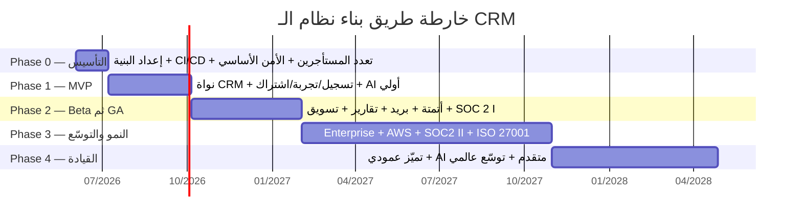

# 🗺️ الوثيقة الرئيسية وخارطة الطريق — نظام CRM متعدد المستأجرين (Multi-tenant SaaS)

> **الحالة:** وثيقة حيّة (Living Document) — النسخة الحالية مبنية على وثيقتَي **البنية التقنية** و**الأمن والامتثال**، وستُثرى بتفاصيل **بحث المنافسين**، **خطة العمل والتسعير**، و**المنتج والميزات** فور اكتمالها.
> **آخر تحديث:** 2026-06-02

---

## ١. الرؤية والملخص التنفيذي

نبني **نظام CRM سحابي متعدد المستأجرين (Multi-tenant SaaS)** موجّهاً للشركات (B2B)، ينافس كبار اللاعبين (Salesforce / HubSpot / Zoho / Pipedrive). كل عمل تجاري يحصل على **مستأجر (Tenant)** خاص ومعزول، عبر **تسجيل ذاتي (self-service)** → **تجربة مجانية ١٤ يوماً** → **اشتراك شهري مدفوع**.

**مبادئ المنتج التوجيهية:**
- 🧩 **غني بالميزات (feature-rich):** تغطية كاملة لوحدات الـ CRM، لا الحد الأدنى.
- 🤝 **أقصى تسهيلات للعميل:** onboarding سهل، تجربة مرنة، فوترة مرنة، تكاملات واسعة، دعم قوي.
- 🌍 **تعريب كامل وRTL** كميزة تمايز في السوق العربي + دعم متعدد اللغات.
- 🔐 **أمان وامتثال من اليوم الأول** (عزل المستأجرين، GDPR، مسار SOC 2 / ISO 27001).
- 🤖 **الذكاء الاصطناعي (Claude)** كميزة جوهرية لا إضافة شكلية.
- ⚙️ **قابلية التوسّع:** من startup إلى enterprise دون إعادة بناء.

---

## ٢. خريطة الوثائق

| # | الوثيقة | المحتوى | الحالة |
|---|---------|---------|--------|
| 00 | `00-overview-and-roadmap.md` | الوثيقة الرئيسية + خارطة الطريق (هذه) | 🟡 حيّة |
| 01 | `01-market-and-competitor-research.md` | بحث المنافسين والسوق وفرص التمايز | 🔄 قيد الإعداد |
| 02 | `02-business-plan-and-pricing.md` | نموذج العمل، التسعير، الاقتصاديات، GTM | 🔄 قيد الإعداد |
| 03 | `03-product-features-and-roadmap.md` | الشخصيات، كتالوج الميزات، الأولويات، الرحلات | 🔄 قيد الإعداد |
| 04 | `04-technical-architecture.md` | تعدد المستأجرين، Tech Stack، نموذج البيانات | ✅ جاهزة |
| 05 | `05-security-and-compliance.md` | عزل البيانات، المصادقة، خارطة الامتثال | ✅ جاهزة |

---

## ٣. القرارات الأساسية المعتمدة (من الوثائق الجاهزة)

**من البنية التقنية (04):**
- **تعدد المستأجرين:** نمط **Pool** (جداول مشتركة + `tenant_id`) مع **PostgreSQL Row-Level Security (RLS)**؛ مسار ترقية لاحق: Pool → Schema → Silo DB للعملاء Enterprise.
- **Tech Stack:** Next.js 15 (RTL/i18n) · NestJS (Modular Monolith) · PostgreSQL 17 + Prisma · Redis + BullMQ · Typesense (بحث) · Claude Haiku/Sonnet + pgvector (AI) · Stripe Billing · OpenTelemetry/Grafana/Sentry.
- **البنية التحتية:** بدء بـ Railway + Neon → الانتقال إلى AWS EKS عند ~‏$50K MRR.
- **Feature Flags** (Unleash) من اليوم الأول.

**من الأمن والامتثال (05):**
- عزل متعدد الطبقات: **RLS + Tenant Middleware + مفاتيح Cache/Storage تتضمن tenant_id**.
- مصادقة صارمة: JWT قصير (١٥ دقيقة) + Refresh Token (HttpOnly) + 2FA إلزامي للـ Admins، و**WorkOS/Auth0** كطبقة مصادقة جاهزة (SAML/OIDC/MFA).
- خارطة امتثال من ٥ مراحل: الأساس → GDPR/CCPA → SOC 2 Type I → SOC 2 Type II → ISO 27001 → Enterprise Hardening.
- **`tenant_id` في كل جدول من اليوم الأول** + **Audit Log** منفصل (append-only).

---

## ٤. خارطة الطريق المرحلية (من الصفر حتى المنتج النهائي)

---

### 🏗️ المرحلة 0 — التأسيس (Foundation) · ~٤–٦ أسابيع

**الهدف:** تجهيز كل ما يلزم للبناء بأمان وسرعة.

**المخرجات:**
- إعداد المستودع (monorepo)، خطوط CI/CD، البيئات (dev/staging/prod)، Infrastructure as Code.
- هيكل أساسي: Next.js + NestJS + PostgreSQL + Prisma + Redis.
- **أساس تعدد المستأجرين:** `tenant_id` في كل جدول + RLS + `TenantContext` middleware.
- طبقة المصادقة (WorkOS/Auth0 أو JWT مخصّص)، نظام الأدوار والصلاحيات (RBAC) الأساسي.
- نظام التصميم (shadcn/ui + Tailwind) مع **RTL/i18n** من البداية.
- أساس المراقبة (OpenTelemetry/Sentry)، إدارة الأسرار، التشفير، حساب Stripe (test mode)، Feature Flags.

**معيار الخروج:** تسجيل مستأجر + تسجيل دخول + بيانات معزولة بـ RLS + نشر آلي إلى staging.
**الفريق:** ٢–٣ مهندسين + مصمم/PM بدوام جزئي.

---

### 🚀 المرحلة 1 — MVP قابل للبيع · ~٨–١٢ أسبوعاً

**الهدف:** نواة CRM كاملة الحلقة (تسجيل → تجربة → اشتراك) قابلة للبيع.

**المخرجات (المنتج):**
- تسجيل ذاتي للمستأجر + **تجربة ١٤ يوماً** + تحويل إلى **اشتراك مدفوع (Stripe)**.
- إدارة المستخدمين والأدوار (RBAC).
- وحدات النواة: **Contacts & Accounts** · **Leads** + نماذج التقاط · **Deals/Pipeline** (Kanban + مراحل) · **Activities/Tasks/Calendar** · Notes.
- تسجيل البريد الأساسي، الاستيراد/التصدير (CSV)، لوحة معلومات وتقارير أساسية، الإشعارات، الحقول المخصّصة (أساسية).
- **ميزة AI أولى:** تقييم العملاء المحتملين (lead scoring) أو صياغة رسائل عبر Claude.
- تعريب كامل + RTL.

**المخرجات (الأمن/الامتثال):** فرض RLS + اختبارات عزل · 2FA للـ Admins · Audit Log · PCI SAQ-A · سياسة خصوصية + قالب DPA · أساسيات GDPR.

**المخرجات (GTM):** صفحة هبوط + صفحة أسعار + صفحة "Security" + تدفّق onboarding + مركز مساعدة.

**معيار الخروج:** عملاء تجريبيون خارجيون يسجّلون، يستخدمون النواة، ويتحوّلون لمدفوع؛ العزل مُختبَر.
**الفريق:** ٤–٦ (إضافة QA ومصمم).

---

### 📣 المرحلة 2 — Beta ثم الإطلاق العام (GA) · ~٤ أشهر

**الهدف:** تصليب المنتج، توسيع الميزات، الإطلاق العام.

**المخرجات (المنتج):**
- **أتمتة سير العمل** (rules/triggers/sequences).
- **تكامل البريد** (Gmail/Outlook تزامن ثنائي) + قوالب + تتبّع.
- تقارير ولوحات متقدمة، وحدة **التسويق** (campaigns/email sequences).
- AI موسّع: تلخيص، مساعد محادثة، توقّعات.
- **الجوال** (PWA أو تطبيق)، **Public API + Webhooks**، أساس **Marketplace**.
- تخصيص متقدم + لغات إضافية.

**المخرجات (الأمن/الامتثال):** **SOC 2 Type I** + بدء جمع أدلة Type II · Pentest · Bug Bounty · 2FA لكل المستخدمين · **SSO/SAML** للـ Enterprise.

**المخرجات (GTM):** قمع PLG، تسويق محتوى، شراكات، تحسين التحويل.

**معيار الخروج:** إطلاق عام + عملاء مدفوعون + تتبّع churn/conversion + SOC 2 Type I.
**الفريق:** ٨–١٢.

---

### 📈 المرحلة 3 — النمو والتوسّع (Growth & Enterprise) · ~٩ أشهر

**الهدف:** توسعة البنية، جاهزية Enterprise، توسيع المنتج.

**المخرجات:**
- ترحيل Railway+Neon → **AWS EKS** (عند ~‏$50K MRR) + **multi-region**.
- تحليلات/BI متقدمة · **CPQ/عروض الأسعار/المنتجات/الفوترة** · وحدة **الدعم/التذاكر**.
- **Marketplace** ونظام بيئي للإضافات · AI متقدم (**RAG** على بيانات المستأجر، وكلاء) · أتمتة متقدمة.
- ميزات حوكمة وإدارة للـ Enterprise (SCIM، إدارة متقدمة).

**المخرجات (الأمن/الامتثال):** **SOC 2 Type II** (نافذة ١٢ شهراً) · **ISO 27001** · data residency متقدمة · SSO/SCIM للـ Enterprise.

**المخرجات (GTM):** حركة Sales-led للـ Mid-market/Enterprise، إيرادات توسّع (expansion)، Customer Success.

**معيار الخروج:** صفقات Enterprise + SOC 2 Type II + ISO 27001 + NRR قوي.
**الفريق:** ١٥–٣٠.

---

### 🏆 المرحلة 4 — القيادة والتميّز · مستمر (الشهر ١٨+)

**الهدف:** المنافسة المباشرة لكبار اللاعبين.

**المخرجات:** إصدارات عمودية (vertical editions) · **AI/Agentic CRM** متقدم · منصة تخصيص no-code · توسّع عالمي · White-label/شركاء · حوكمة وامتثال متقدم (HIPAA BAA عند اللزوم) · Pentest مستمر + Bug Bounty عام + DPO.

---

## ٥. ملخص الجدول الزمني والفريق (تقديري)

| المرحلة | المدة | الفريق | أبرز معيار خروج |
|---------|------|--------|------------------|
| 0 — التأسيس | ٤–٦ أسابيع | ٢–٣ | مستأجر معزول + نشر آلي |
| 1 — MVP | ٨–١٢ أسبوعاً | ٤–٦ | حلقة تسجيل→تجربة→اشتراك تعمل |
| 2 — Beta/GA | ~٤ أشهر | ٨–١٢ | إطلاق عام + SOC 2 Type I |
| 3 — النمو | ~٩ أشهر | ١٥–٣٠ | Enterprise + SOC 2 II + ISO 27001 |
| 4 — القيادة | مستمر | ٣٠+ | ريادة سوقية + توسّع عالمي |

> 💡 *تقديرات الفريق والميزانية ستُضبط بدقّة في وثيقة **خطة العمل (02)** عند اكتمالها.*

---

## ٦. المخاطر الرئيسية (أولية)

| الخطر | التخفيف |
|-------|---------|
| تسريب بيانات عبر المستأجرين (cross-tenant) | RLS + middleware + اختبارات عزل آلية في CI |
| تأخّر الامتثال (SOC 2/ISO) يعيق صفقات Enterprise | بدء جمع الأدلة من الإطلاق + ميزانية مبكّرة |
| تضخّم النطاق (scope creep) في MVP | التزام صارم بقائمة MVP وتأجيل الباقي |
| تكاليف AI غير مضبوطة | توجيه Haiku/Sonnet + Prompt Caching + حدود حسب الباقة |
| المنافسة الشرسة من الكبار | التمايز بالتعريب/RTL + السعر + سهولة الاستخدام + AI |

---

## ٧. المتبقّي لإكمال هذه الوثيقة

- [ ] دمج **بحث المنافسين (01):** مصفوفة الميزات وفرص التمايز ← تؤثر على أولويات الميزات.
- [ ] دمج **خطة العمل (02):** الباقات والأسعار والاقتصاديات ← تضبط الميزانية والفريق ومعالم الإيراد.
- [ ] دمج **الميزات (03):** تصنيف MVP/V1/V2/V3 ورحلات المستخدم ← تضبط محتوى كل مرحلة.

---

*هذه خارطة طريق حيّة تُحدَّث مع تقدّم التخطيط والتنفيذ.*
