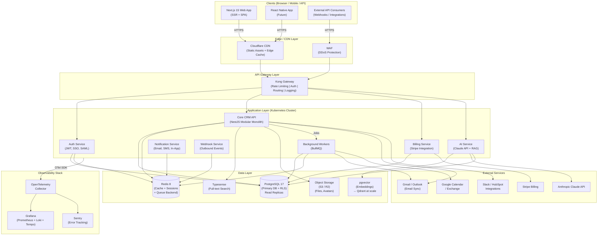
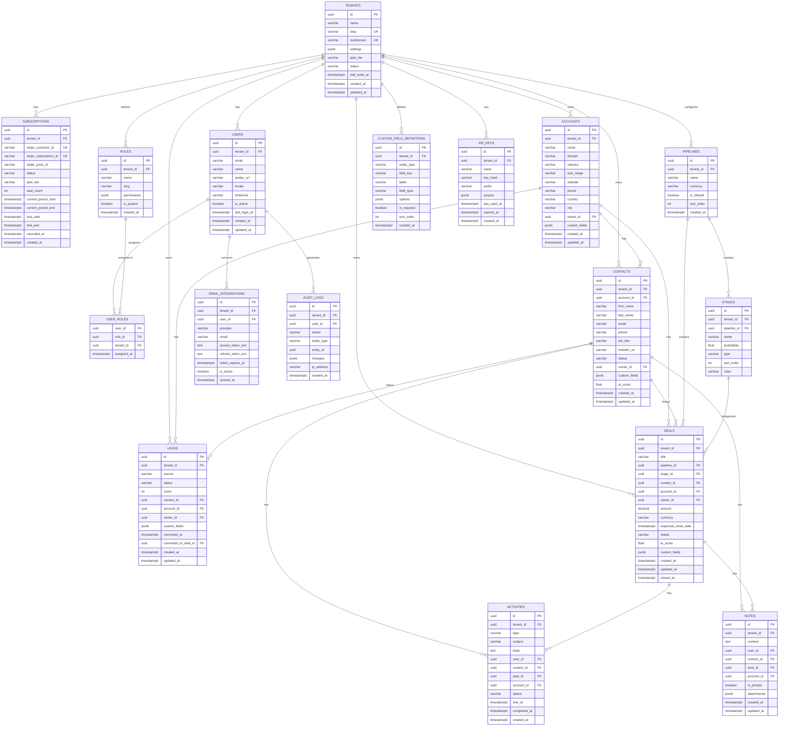
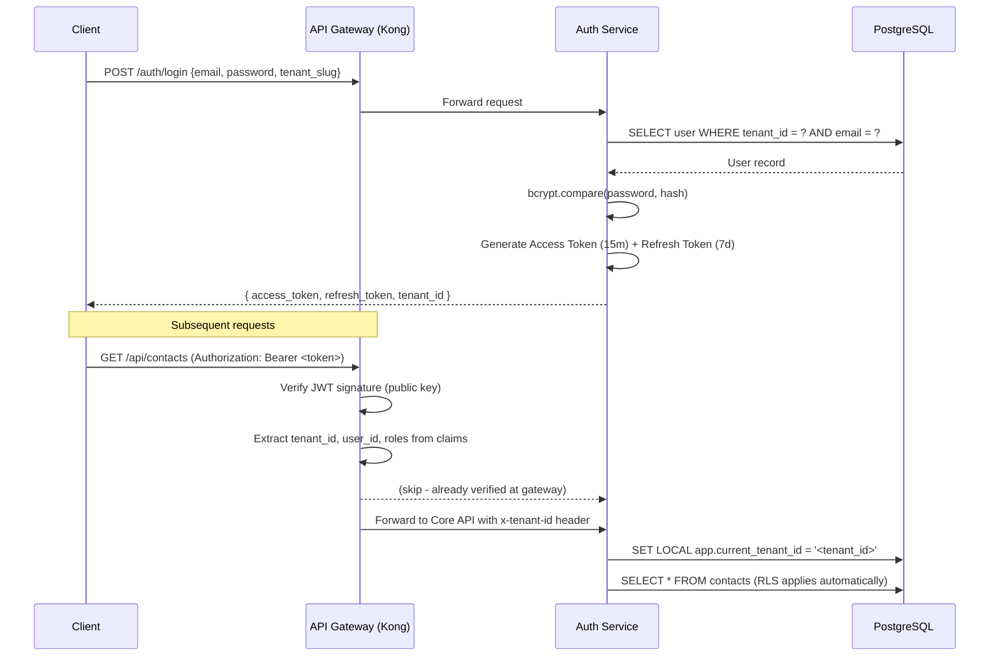
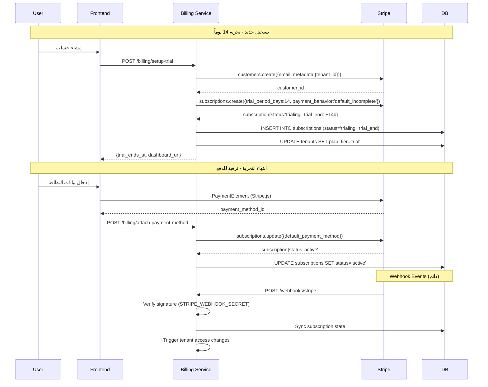
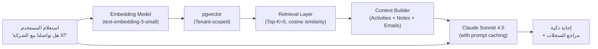
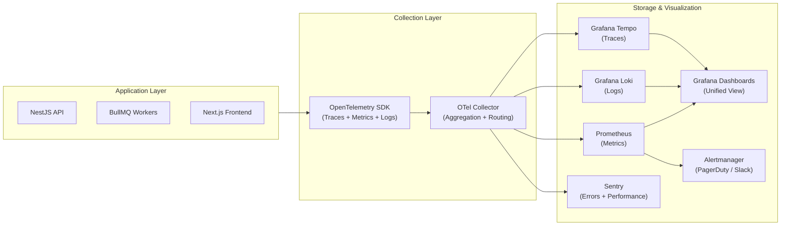
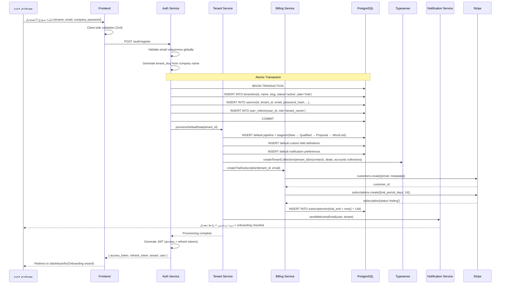

# الوثيقة الهندسية الشاملة — نظام CRM متعدد المستأجرين

**تاريخ الإصدار:** 2026-06-02  
**الإصدار:** 1.0  
**الحالة:** مسودة معتمدة للمراجعة الهندسية

---

## فهرس المحتويات

1. [استراتيجية تعدد المستأجرين (Multi-tenancy)](#1-استراتيجية-تعدد-المستأجرين)
2. [مكدّس التقنيات الموصى به (Tech Stack)](#2-مكدّس-التقنيات-الموصى-به)
3. [النظرة المعمارية العليا (High-Level Architecture)](#3-النظرة-المعمارية-العليا)
4. [معمارية الخلفية (Backend Architecture)](#4-معمارية-الخلفية)
5. [نموذج البيانات (Data Model / ERD)](#5-نموذج-البيانات)
6. [المصادقة والصلاحيات (Auth & RBAC)](#6-المصادقة-والصلاحيات)
7. [تكامل الفوترة (Billing Integration)](#7-تكامل-الفوترة)
8. [التكاملات الخارجية (Integrations)](#8-التكاملات-الخارجية)
9. [معمارية الذكاء الاصطناعي (AI Architecture)](#9-معمارية-الذكاء-الاصطناعي)
10. [قابلية التوسّع والأداء (Scalability & Performance)](#10-قابلية-التوسّع-والأداء)
11. [DevOps والبنية التحتية](#11-devops-والبنية-التحتية)
12. [المراقبة والرصد (Observability)](#12-المراقبة-والرصد)
13. [تدفّق توفير المستأجر (Tenant Provisioning)](#13-تدفّق-توفير-المستأجر)
14. [قرارات معمارية متقاطعة وأمنية](#14-قرارات-معمارية-متقاطعة-وأمنية)

---

## 1. استراتيجية تعدد المستأجرين

### 1.1 مقارنة الأنماط الثلاثة

| المعيار | Silo (DB منفصلة) | Bridge (Schema لكل Tenant) | Pool (جداول مشتركة + tenant_id) |
|---|---|---|---|
| **العزل** | أقوى — كامل | متوسط | عبر RLS |
| **تكلفة البنية التحتية** | عالية جداً | متوسطة | منخفضة |
| **سرعة التوسّع** | بطيئة (schema جديد/DB لكل عميل) | بطيئة-متوسطة | سريعة جداً |
| **تعقيد الترحيل (Migrations)** | تشغيل migration لكل DB | تشغيل migration لكل Schema | migration واحد لجميع المستأجرين |
| **مناسب لـ** | Enterprise بمتطلبات امتثال صارمة | Enterprise متوسط | SMB/Startup → Scale |
| **تخصيص حسب العميل** | أقصى مرونة | مرونة جيدة | محدود |
| **استعادة البيانات (Point-in-time)** | سهلة لكل tenant | متوسطة | معقدة لكل tenant |

### 1.2 التوصية: نمط Pool أولاً مع مسار ترقية Silo

**التوصية الأساسية: Pool Model (Shared Tables + tenant_id + PostgreSQL RLS)**

**المبررات:**
- في المرحلة الأولى (0 → 5,000 tenant)، يكون Pool Model الخيار الأمثل من حيث تكلفة التشغيل وسرعة التطوير.
- PostgreSQL Row-Level Security (RLS) يوفر عزلاً حقيقياً على مستوى قاعدة البيانات، وليس فقط على مستوى التطبيق.
- migration واحد يُطبَّق على الجميع مما يُسرِّع تسليم الميزات.
- أُثبت بتجربة حقيقية أن RLS مع Composite Index (tenant_id كعمود أول) يحقق أداءً عالياً عند 50M صف و10K tenant بفارق زمني أقل من 1ms على 95th percentile.

**مسار الترقية للعملاء Enterprise:**
```
Pool (shared) 
    → على طلب العميل أو عند الوصول لحد تعاقدي → Schema Isolation (schema per tenant على نفس PG cluster)
    → للعملاء الكبار جداً (Financial, Healthcare, Gov) → Silo (DB منفصلة أو Dedicated Cluster)
```

### 1.3 تطبيق PostgreSQL Row-Level Security

```sql
-- 1. تفعيل RLS على كل الجداول الحساسة
ALTER TABLE contacts ENABLE ROW LEVEL SECURITY;
ALTER TABLE deals    ENABLE ROW LEVEL SECURITY;
ALTER TABLE accounts ENABLE ROW LEVEL SECURITY;
-- ... جميع الجداول

-- 2. دالة مساعدة للحصول على current_tenant من JWT context
CREATE OR REPLACE FUNCTION current_tenant_id() RETURNS UUID AS $$
  SELECT NULLIF(current_setting('app.current_tenant_id', TRUE), '')::UUID;
$$ LANGUAGE sql STABLE;

-- 3. Policy للقراءة والكتابة
CREATE POLICY tenant_isolation_policy ON contacts
  USING       (tenant_id = current_tenant_id())
  WITH CHECK  (tenant_id = current_tenant_id());

-- 4. في بداية كل request (في middleware الخلفية):
-- SET LOCAL app.current_tenant_id = '<uuid-from-jwt>';

-- 5. Composite Index للأداء (tenant_id أولاً دائماً)
CREATE INDEX idx_contacts_tenant_id_created_at ON contacts (tenant_id, created_at DESC);
CREATE INDEX idx_deals_tenant_id_stage_id      ON deals     (tenant_id, stage_id);
CREATE INDEX idx_activities_tenant_id_user_id  ON activities(tenant_id, user_id, created_at DESC);
```

**قواعد RLS الواجب الالتزام بها:**
- دور التطبيق (`app_role`) لا يملك BYPASSRLS أبداً.
- دور الـ migrations (`migrations_role`) منفصل ويُستخدم فقط لتشغيل Schema changes.
- دور الـ admin (`admin_role`) يمتلك policy-based access (ليس BYPASSRLS) للحفاظ على الـ audit trail.

---

## 2. مكدّس التقنيات الموصى به

### 2.1 الجدول الشامل

| الطبقة | التقنية المختارة | البديل المرفوض | المبرر |
|---|---|---|---|
| **Frontend Framework** | Next.js 15 (App Router) | Remix, SvelteKit | React Server Components، SSR/SSG، Edge Functions، ecosystem واسع، Vercel integration |
| **UI Components** | shadcn/ui + Radix UI | MUI, Ant Design | headless، قابل للتخصيص الكامل، RTL-friendly |
| **CSS** | Tailwind CSS v4 | Styled-components | أداء build أسرع، consistency، utility-first |
| **State Management** | Zustand + TanStack Query v5 | Redux | أخف وزناً، server state منفصل عن client state |
| **Forms** | React Hook Form + Zod | Formik | أداء أعلى، type-safety كاملة |
| **i18n / RTL** | next-intl + CSS logical properties | i18next | تكامل أعمق مع Next.js App Router |
| **Backend Language** | TypeScript (Node.js 22 LTS) | Go, Python | ecosystem مشترك مع frontend، type-safety، NestJS |
| **Backend Framework** | NestJS v11 | Express plain, Fastify | DI container، modular، decorators، Guards، Interceptors، enterprise-grade |
| **Database Primary** | PostgreSQL 17 | MySQL, MongoDB | RLS، JSONB، full-text search، extensions، ACID |
| **Database ORM** | Prisma v6 | TypeORM, Drizzle | type-safe، migrations، Prisma Accelerate |
| **Cache / Sessions** | Redis 8 (via Upstash/Valkey) | Memcached | pub/sub، sorted sets، streams، TTL |
| **Queue / Jobs** | BullMQ (Redis-backed) | RabbitMQ, SQS | integration native مع NestJS، retry، priority |
| **Search** | Typesense (self-hosted) أو Algolia | Elasticsearch | أخف في التشغيل، سريع جداً، SaaS option |
| **Object Storage** | AWS S3 / Cloudflare R2 | GCS | r2 بدون egress fees للـ CDN |
| **Email Delivery** | Resend (Transactional) + Amazon SES (bulk) | SendGrid | Resend: DX ممتاز، SES: تكلفة منخفضة للحجم الكبير |
| **SMS / Notifications** | Knock.fyi (notification orchestration) | Custom, Novu | multi-channel، templates، preferences |
| **Auth** | custom JWT + Passport.js + Auth0/Clerk (SSO) | Firebase Auth | تحكم كامل + SSO/SAML للـ enterprise |
| **Billing** | Stripe Billing | Paddle, Chargebee | ecosystem، webhooks، documentation، tax automation |
| **AI / LLM** | Anthropic Claude (Sonnet 4.5) + Haiku للمهام البسيطة | OpenAI only | prompt caching (خصم 90%)، context window ضخم، security |
| **Vector DB** | pgvector (على نفس PG) → Qdrant عند scale | Pinecone | pgvector: simplicity أولاً، Qdrant عند 10M+ vectors |
| **API Gateway** | Kong Gateway أو AWS API Gateway | Nginx plain | rate limiting، auth plugins، observability |
| **Container** | Docker + Kubernetes (K8s via EKS/GKE) | Docker Swarm | industry standard، Helm charts |
| **IaC** | Terraform + Terragrunt | Pulumi, CDK | ecosystem أوسع |
| **CI/CD** | GitHub Actions | Jenkins, CircleCI | integration GitHub، free minutes، ecosystem |
| **Monitoring** | OpenTelemetry → Grafana Stack (Prometheus, Loki, Tempo) | Datadog (تكلفة) | open-source، unified، industry standard 2026 |
| **Error Tracking** | Sentry | Rollbar | أكثر انتشاراً، رابط مع OTel |
| **Feature Flags** | Unleash (self-hosted) أو Growthbook | LaunchDarkly (تكلفة) | open-source، A/B testing built-in |

### 2.2 RTL وi18n على مستوى الواجهة

```typescript
// next-intl configuration (next.config.ts)
// اللغات المدعومة: العربية (ar) + الإنجليزية (en)
// الاتجاه: يُحدَّد في layout.tsx بناءً على locale

// app/[locale]/layout.tsx
export default function RootLayout({ children, params: { locale } }) {
  const direction = locale === 'ar' ? 'rtl' : 'ltr';
  return (
    <html lang={locale} dir={direction}>
      <body className={`font-sans antialiased`}>{children}</body>
    </html>
  );
}
```

**Tailwind CSS v4 + CSS Logical Properties للـ RTL:**
```css
/* بدلاً من: margin-left, padding-right */
/* استخدام: margin-inline-start, padding-inline-end */
/* Tailwind v4 يدعم: ms-4 (margin-inline-start), pe-2 (padding-inline-end) */
```

**خطوط:**
- عربية: Noto Sans Arabic / IBM Plex Arabic (via Google Fonts أو self-hosted)
- إنجليزية: Inter

---

## 3. النظرة المعمارية العليا



---

## 4. معمارية الخلفية

### 4.1 REST مقابل GraphQL

**التوصية: REST API أولاً، مع GraphQL للـ enterprise/integrations لاحقاً**

| المعيار | REST | GraphQL |
|---|---|---|
| سهولة التطوير الأولي | أعلى | أعلى تعقيداً |
| caching | طبيعي (HTTP cache) | معقد |
| over-fetching | موجود | محلول |
| tooling maturity | ممتاز | جيد |
| التوصية للمرحلة الأولى | ✅ | لاحقاً |

**استراتيجية:** REST API مصمم بعناية مع OpenAPI 3.1 spec + Swagger UI. عند اكتمال المنتج والبدء في استقطاب عملاء enterprise، يُضاف GraphQL endpoint اختياري.

### 4.2 Modular Monolith vs Microservices

**التوصية: Modular Monolith الآن → Strangler Fig للـ extraction لاحقاً**

```
المرحلة 1 (0-18 شهر): Modular Monolith
├── كل module له حدوده الواضحة (bounded context)
├── لا مشاركة Database بين modules (إلا عبر service layer)
├── deployed كـ single binary / single container
└── سرعة التطوير الأقصى، complexity أدنى

المرحلة 2 (18-36 شهر): Extraction حسب الحاجة
├── AI Service → خارج الـ monolith (Python/FastAPI للـ ML workloads)
├── Billing Service → خارج (isolated failure domain)
├── Notification/Webhook Service → خارج (حجم مختلف)
└── Core CRM → يبقى monolith

المرحلة 3 (36+ شهر): Selective Microservices
└── حسب Conway's Law: فقط عندما الفرق تحتاج autonomy حقيقية
```

**Strangler Fig Pattern:**
```
API Gateway يستقبل كل الطلبات
    ↓
يُوجَّه إلى Monolith افتراضياً
    ↓
عند extraction service → يُوجَّه routing للـ service الجديد
    ↓
module في الـ monolith يُحذف تدريجياً
```

### 4.3 تنظيم Modules داخل NestJS Modular Monolith

```
src/
├── main.ts
├── app.module.ts
│
├── modules/
│   ├── auth/               # JWT, sessions, SSO, SAML
│   ├── tenants/            # Tenant provisioning, settings
│   ├── users/              # User CRUD, profile
│   ├── roles/              # RBAC roles, permissions
│   │
│   ├── contacts/           # Contact management
│   ├── accounts/           # Account/Company management
│   ├── leads/              # Lead management + scoring
│   ├── deals/              # Deal pipeline + stages
│   ├── activities/         # Calls, meetings, tasks
│   ├── notes/              # Notes + attachments
│   ├── pipelines/          # Pipeline configuration
│   │
│   ├── custom-fields/      # Dynamic fields per entity
│   ├── imports/            # CSV/Excel import
│   ├── exports/            # Data export
│   │
│   ├── billing/            # Stripe integration
│   ├── subscriptions/      # Plan management
│   │
│   ├── integrations/       # Gmail, Outlook, Calendar
│   ├── webhooks/           # Outbound webhooks
│   ├── public-api/         # API keys, rate limits
│   │
│   ├── ai/                 # Claude API, RAG, embeddings
│   ├── notifications/      # Email, SMS, in-app
│   ├── search/             # Typesense integration
│   └── analytics/          # Reports, dashboards
│
├── common/
│   ├── guards/             # TenantGuard, AuthGuard, RolesGuard
│   ├── interceptors/       # TenantContext, Logging, Timing
│   ├── decorators/         # @CurrentTenant, @CurrentUser, @Permissions
│   ├── filters/            # GlobalException filter
│   ├── pipes/              # Validation, Transform
│   └── middleware/         # TenantResolution, RLS setup
│
├── database/
│   ├── prisma.service.ts
│   ├── migrations/
│   └── seeds/
│
└── config/
    ├── database.config.ts
    ├── redis.config.ts
    ├── stripe.config.ts
    └── ai.config.ts
```

**TenantContext Middleware (الأهم أمنياً):**
```typescript
@Injectable()
export class TenantContextMiddleware implements NestMiddleware {
  async use(req: Request, res: Response, next: NextFunction) {
    const tenantId = this.resolveTenantId(req); // من JWT أو subdomain
    if (!tenantId) throw new UnauthorizedException('Tenant not resolved');
    
    // تعيين context لـ RLS
    await this.prisma.$executeRaw`
      SELECT set_config('app.current_tenant_id', ${tenantId}, TRUE)
    `;
    
    req['tenantId'] = tenantId;
    next();
  }
}
```

---

## 5. نموذج البيانات

### 5.1 ERD الكامل



### 5.2 الفهارس الأساسية

```sql
-- Tenant-first composite indexes (حاسمة للـ RLS performance)
CREATE UNIQUE INDEX idx_users_tenant_email       ON users (tenant_id, email);
CREATE INDEX idx_contacts_tenant_account         ON contacts (tenant_id, account_id);
CREATE INDEX idx_contacts_tenant_owner           ON contacts (tenant_id, owner_id);
CREATE INDEX idx_deals_tenant_stage              ON deals (tenant_id, stage_id, status);
CREATE INDEX idx_deals_tenant_owner_close        ON deals (tenant_id, owner_id, expected_close_date);
CREATE INDEX idx_activities_tenant_due           ON activities (tenant_id, due_at) WHERE status = 'pending';
CREATE INDEX idx_leads_tenant_status_score       ON leads (tenant_id, status, score DESC);
CREATE INDEX idx_audit_logs_tenant_created       ON audit_logs (tenant_id, created_at DESC);

-- Full-text search (Postgres native كـ fallback)
CREATE INDEX idx_contacts_fts ON contacts
  USING GIN (to_tsvector('simple', coalesce(first_name,'') || ' ' || coalesce(last_name,'') || ' ' || coalesce(email,'')));

-- JSONB indexes للـ custom_fields
CREATE INDEX idx_contacts_custom_fields ON contacts USING GIN (custom_fields);
```

---

## 6. المصادقة والصلاحيات

### 6.1 استراتيجية JWT مع Tenant Scoping



**JWT Payload Structure:**
```json
{
  "sub": "user-uuid",
  "tid": "tenant-uuid",
  "email": "user@company.com",
  "roles": ["admin", "sales_manager"],
  "permissions": ["contacts:read", "contacts:write", "deals:read"],
  "plan": "professional",
  "iat": 1748825600,
  "exp": 1748826500
}
```

### 6.2 Tenant Resolution

**الأولوية:**
1. **Subdomain:** `company.crm.app` → slug = `company`
2. **Custom Domain:** `crm.company.com` → lookup في `tenants.custom_domain`
3. **Header:** `X-Tenant-ID` للـ API keys

### 6.3 RBAC — الأدوار الافتراضية

| الدور | الوصف | الصلاحيات |
|---|---|---|
| `super_admin` | مسؤول التطبيق الكامل (نظام) | كل شيء |
| `tenant_owner` | مالك الـ tenant | كل صلاحيات الـ tenant |
| `tenant_admin` | مسؤول الـ tenant | CRUD كامل + إدارة المستخدمين |
| `sales_manager` | مدير المبيعات | CRUD على deals/contacts، رؤية الفريق |
| `sales_rep` | مندوب مبيعات | CRUD على سجلاته فقط |
| `viewer` | قارئ فقط | Read-only على كل الموارد |

**Permission granularity:**
```
{resource}:{action}
contacts:read | contacts:write | contacts:delete
deals:read | deals:write | deals:delete
reports:view | settings:manage | users:invite
```

### 6.4 SSO/SAML/OAuth للـ Enterprise

| البروتوكول | الاستخدام | الحل |
|---|---|---|
| **SAML 2.0** | Enterprise SSO (Okta, Azure AD) | passport-saml + samlify |
| **OAuth 2.0 / OIDC** | Google Workspace, Microsoft 365 | passport-google-oauth20, passport-microsoft |
| **SCIM 2.0** | User provisioning/deprovisioning | scimify library |

**Enterprise SSO Configuration per Tenant:**
```
tenants.sso_config: {
  "provider": "saml",
  "idp_metadata_url": "https://...",
  "idp_entity_id": "...",
  "attribute_mapping": {
    "email": "http://schemas.xmlsoap.org/.../emailaddress",
    "name": "http://schemas.xmlsoap.org/.../givenname"
  }
}
```

---

## 7. تكامل الفوترة

### 7.1 معمارية Stripe



### 7.2 Webhook Events الأساسية

```typescript
// webhooks/stripe.controller.ts
const HANDLED_EVENTS = {
  // التجربة المجانية
  'customer.subscription.trial_will_end':  handleTrialWillEnd,  // 3 أيام قبل الانتهاء
  
  // دورة الاشتراك
  'customer.subscription.created':         handleSubscriptionCreated,
  'customer.subscription.updated':         handleSubscriptionUpdated,
  'invoice.payment_succeeded':             handlePaymentSucceeded,
  
  // فشل الدفع
  'invoice.payment_failed':                handlePaymentFailed,
  'invoice.payment_action_required':       handleActionRequired,
  
  // الإلغاء والتعطيل
  'customer.subscription.deleted':         handleSubscriptionCanceled,
  
  // ترقية/تخفيض الخطة
  'customer.subscription.updated':         handlePlanChanged,
};

async function handlePaymentFailed(event: Stripe.Event) {
  const invoice = event.data.object as Stripe.Invoice;
  const tenantId = invoice.metadata.tenant_id;
  
  // Grace period: 7 أيام قبل تعطيل الحساب
  await db.subscriptions.update({
    where: { stripe_customer_id: invoice.customer },
    data: {
      status: 'past_due',
      grace_period_ends_at: addDays(new Date(), 7),
    }
  });
  
  // إشعار المستخدم بالبريد الإلكتروني
  await notificationService.sendPaymentFailedEmail(tenantId);
}
```

### 7.3 حالات الاشتراك وانعكاساتها على الوصول

```
trialing      → وصول كامل للخطة المحددة
active        → وصول كامل
past_due      → وصول كامل + banner تحذيري (grace period 7 أيام)
paused        → read-only access فقط
canceled      → read-only access لمدة 30 يوماً ثم data export فقط
incomplete    → إنهاء إعداد الدفع مطلوب
```

### 7.4 خطط الاشتراك

```typescript
const PLANS = {
  starter: {
    seats: 5,
    contacts_limit: 5_000,
    deals_limit: 1_000,
    ai_credits: 100,   // per month
    price_monthly: 29,
    features: ['core_crm', 'email_integration', 'basic_reports'],
  },
  professional: {
    seats: 25,
    contacts_limit: 50_000,
    deals_limit: null,   // unlimited
    ai_credits: 1_000,
    price_monthly: 99,
    features: [...starter.features, 'ai_scoring', 'custom_fields', 'api_access', 'webhooks'],
  },
  enterprise: {
    seats: null,   // unlimited
    contacts_limit: null,
    ai_credits: null,
    price_monthly: 'custom',
    features: [...professional.features, 'sso_saml', 'scim', 'dedicated_support', 'sla', 'custom_domain'],
  }
};
```

---

## 8. التكاملات الخارجية

### 8.1 تكامل البريد الإلكتروني

**Gmail / Google Workspace:**
- OAuth 2.0 + Google People API + Gmail API
- Two-way sync: استيراد رسائل الـ contacts + إرسال من داخل CRM
- Email tracking: pixel 1x1 لقراءة فتح البريد

**Microsoft Outlook / Exchange:**
- Microsoft Graph API + OAuth 2.0
- Exchange Web Services (EWS) للـ on-premises

```typescript
// Email sync job (BullMQ)
@Processor('email-sync')
export class EmailSyncProcessor {
  @Process('sync-inbox')
  async syncInbox(job: Job<{ tenantId: string; userId: string }>) {
    const integration = await this.getEmailIntegration(job.data);
    const emails = await this.gmailService.fetchNew(integration);
    
    for (const email of emails) {
      const contact = await this.matchContact(email.from, job.data.tenantId);
      if (contact) {
        await this.createActivity({
          type: 'email',
          contact_id: contact.id,
          tenant_id: job.data.tenantId,
          subject: email.subject,
          body: email.body,
          created_at: email.date,
        });
      }
    }
  }
}
```

### 8.2 تكامل التقويم

- Google Calendar API + Microsoft Graph Calendar
- اختزال المواعيد كـ Activity (type: 'meeting')
- إمكانية إنشاء مواعيد مرتبطة بـ Deal/Contact من داخل CRM

### 8.3 Webhooks الصادرة (Outbound)

```typescript
// تسجيل webhook endpoint من قِبَل العميل
POST /api/webhooks/subscriptions
{
  "url": "https://customer-app.com/crm-events",
  "events": ["deal.won", "contact.created", "lead.converted"],
  "secret": "auto-generated"
}

// إرسال event
// HMAC-SHA256 signature: X-CRM-Signature: sha256=<hash>
// Retry policy: 3 محاولات (exponential backoff: 5s, 30s, 5min)
// Dead letter queue بعد 3 فشل
```

### 8.4 Public API

```
Base URL: https://api.crm.app/v1
Auth: Bearer Token (API Key) أو OAuth 2.0
Rate Limiting:
  - Starter: 100 req/min
  - Professional: 1,000 req/min
  - Enterprise: 10,000 req/min (negotiable)
Format: JSON, OpenAPI 3.1 spec
Versioning: URL versioning (/v1, /v2)
Pagination: cursor-based (after=<id>&limit=50)
```

### 8.5 Marketplace / إضافات

**مسار MVP (المرحلة الأولى):**
- قائمة تكاملات جاهزة (Slack, Zapier, Make, HubSpot, Salesforce)
- Integration Framework داخلي مبني على Webhook + API Keys

**مسار Scale (المرحلة الثانية):**
- Plugin SDK (TypeScript) يسمح للـ partners ببناء integrations
- iframe sandbox للـ UI extensions
- Marketplace صفحة داخل التطبيق

---

## 9. معمارية الذكاء الاصطناعي

### 9.1 الميزات الذكية

| الميزة | النموذج | النمط | الهدف |
|---|---|---|---|
| Lead Scoring | Claude Haiku + ML features | Structured output | تقدير احتمال التحويل 0-100 |
| Deal Summarization | Claude Sonnet | Direct completion | ملخص آخر تطورات الصفقة |
| Email Drafting | Claude Sonnet | Few-shot prompting | اقتراح ردود على رسائل العملاء |
| Contact Enrichment | Claude Haiku + web data | RAG | استكمال بيانات الـ contact |
| Smart Search | Embedding + pgvector | Semantic search | بحث بالمعنى لا بالكلمة |
| Meeting Notes | Claude Sonnet | Transcription + summary | تلخيص اجتماعات تلقائياً |
| Churn Prediction | Claude + structured data | Analysis | تحديد العملاء المعرضين للمغادرة |

### 9.2 نمط RAG (Retrieval-Augmented Generation)



**Tenant Isolation في pgvector:**
```sql
-- كل vector embedding تحمل tenant_id
CREATE TABLE embeddings (
  id         UUID PRIMARY KEY DEFAULT gen_random_uuid(),
  tenant_id  UUID NOT NULL,
  entity_type VARCHAR(50),  -- 'contact', 'deal', 'note', 'email'
  entity_id  UUID NOT NULL,
  content    TEXT,
  embedding  vector(1536),  -- text-embedding-3-small dimensions
  created_at TIMESTAMPTZ DEFAULT NOW()
);

-- RLS على embeddings أيضاً
ALTER TABLE embeddings ENABLE ROW LEVEL SECURITY;
CREATE POLICY tenant_isolation ON embeddings
  USING (tenant_id = current_tenant_id());

-- HNSW index للأداء
CREATE INDEX idx_embeddings_vector ON embeddings 
  USING hnsw (embedding vector_cosine_ops) 
  WITH (m = 16, ef_construction = 64);
```

### 9.3 إدارة التكلفة والـ Rate Limiting

```typescript
// AI Cost Management
const AI_CONFIG = {
  // استخدام Haiku للمهام البسيطة، Sonnet للمعقدة
  model_routing: {
    lead_scoring:      'claude-haiku-4-5',    // سريع + رخيص
    email_drafting:    'claude-sonnet-4-5',   // جودة عالية
    summarization:     'claude-sonnet-4-5',
    simple_qa:         'claude-haiku-4-5',
  },
  
  // Prompt Caching (خصم 90% على input tokens المتكررة)
  caching: {
    system_prompt_ttl: 300,  // 5 دقائق cache على system prompts الثابتة
    rag_context_ttl: 60,
  },
  
  // Rate Limits per tenant per plan
  rate_limits: {
    starter:      { requests_per_day: 100,  tokens_per_day: 100_000  },
    professional: { requests_per_day: 1000, tokens_per_day: 1_000_000 },
    enterprise:   { requests_per_day: null, tokens_per_day: null      },
  },
};

// AI Usage Tracking
async function trackAIUsage(tenantId: string, model: string, tokens: TokenUsage) {
  await redis.incrby(`ai:usage:${tenantId}:${today()}:tokens`, tokens.total);
  await db.aiUsageLogs.create({ data: { tenantId, model, ...tokens, date: new Date() }});
}
```

---

## 10. قابلية التوسّع والأداء

### 10.1 Caching Strategy

```
L1: Application-level cache (in-memory, NestJS CacheModule)
    → استخدام: tenant settings, permission maps (TTL: 60s)
    → يُمسح: عند تغيير الـ settings

L2: Redis Cache
    → استخدام: user sessions, rate limit counters, search results
    → استخدام: pipeline configs, stage configs (TTL: 5min)
    → Pattern: cache-aside (read-through)

L3: Database Query Cache
    → Prisma Query Engine cache
    → PostgreSQL shared_buffers (25% of RAM)
    → Read Replicas للـ reporting queries
```

**Cache Keys Pattern:**
```
tenant:{tenant_id}:settings         → tenant configuration
tenant:{tenant_id}:user:{user_id}   → user profile + permissions
tenant:{tenant_id}:pipeline:{id}    → pipeline config
rate:{tenant_id}:api:{window}       → API rate limit counter
ai:usage:{tenant_id}:{date}         → AI token usage
```

### 10.2 Background Jobs / Queues

```typescript
// BullMQ Queues
const QUEUES = {
  EMAIL_SYNC:     { concurrency: 5, priority: 'normal' },
  AI_PROCESSING:  { concurrency: 3, priority: 'normal' },
  WEBHOOKS:       { concurrency: 10, priority: 'high', retries: 3 },
  NOTIFICATIONS:  { concurrency: 20, priority: 'high' },
  REPORTS:        { concurrency: 2, priority: 'low' },
  DATA_IMPORT:    { concurrency: 2, priority: 'low' },
  SEARCH_INDEX:   { concurrency: 5, priority: 'normal' },
  BILLING_SYNC:   { concurrency: 5, priority: 'high' },
};

// Recurring Jobs (cron)
const CRON_JOBS = {
  '0 */6 * * *':  'email-sync-all-tenants',
  '0 2 * * *':    'nightly-ai-scoring-refresh',
  '0 3 * * *':    'generate-daily-digests',
  '*/5 * * * *':  'process-webhook-retries',
  '0 4 * * 1':    'weekly-reports-generation',
};
```

### 10.3 Full-Text Search (Typesense)

```typescript
// Typesense Schema per tenant collection
const TYPESENSE_SCHEMA = {
  name: `contacts_${tenantId}`,
  fields: [
    { name: 'id',         type: 'string' },
    { name: 'first_name', type: 'string' },
    { name: 'last_name',  type: 'string' },
    { name: 'email',      type: 'string' },
    { name: 'company',    type: 'string', optional: true },
    { name: 'tags',       type: 'string[]', optional: true },
    { name: 'score',      type: 'float', optional: true },
  ],
  default_sorting_field: 'score',
};

// Real-time indexing عبر Prisma middleware
prisma.$use(async (params, next) => {
  const result = await next(params);
  if (['Contact', 'Deal', 'Account'].includes(params.model)) {
    await searchIndexQueue.add('sync', { model: params.model, id: result.id });
  }
  return result;
});
```

### 10.4 Rate Limiting

```typescript
// Kong Rate Limiting Plugin (API Gateway)
// + Application-level rate limiting (NestJS + Redis)

@UseGuards(ThrottlerGuard)
@Throttle({ default: { ttl: 60000, limit: 100 } }) // per plan
export class ContactsController { ... }

// Token Bucket algorithm في Redis
async checkRateLimit(tenantId: string, plan: string): Promise<boolean> {
  const limit = PLANS[plan].api_rate_limit;
  const key = `rate:${tenantId}:${Math.floor(Date.now() / 60000)}`;
  const current = await redis.incr(key);
  if (current === 1) await redis.expire(key, 60);
  return current <= limit;
}
```

### 10.5 Multi-Region Strategy (مسار مستقبلي)

```
المرحلة 1 (الآن): Single Region (us-east-1 أو eu-west-1 حسب التركيز)
المرحلة 2 (6-12 شهر): Read Replicas في منطقة ثانية
المرحلة 3 (12-24 شهر): Active-Passive failover
المرحلة 4 (Enterprise demand): Active-Active مع data residency per tenant
```

**Data Residency للعملاء Enterprise:**
```sql
-- tenant metadata يحدد المنطقة
ALTER TABLE tenants ADD COLUMN data_region VARCHAR(20) DEFAULT 'us-east-1';
-- Routing في API Gateway: x-tenant-region header → يُوجَّه للـ cluster المناسب
```

---

## 11. DevOps والبنية التحتية

### 11.1 البيئات

| البيئة | الغرض | Infrastructure |
|---|---|---|
| `development` | بيئة المطور المحلية | Docker Compose (PG + Redis + Typesense) |
| `preview` | كل PR يحصل على environment مؤقت | Vercel Preview + Neon DB branch |
| `staging` | اختبار قبل الإطلاق، mirrors production | EKS cluster مصغر |
| `production` | الإنتاج | EKS (multi-AZ) |

### 11.2 Docker Compose للتطوير

```yaml
# docker-compose.dev.yml
services:
  postgres:
    image: postgres:17-alpine
    environment:
      POSTGRES_DB: crm_dev
      POSTGRES_PASSWORD: dev_password
    ports: ["5432:5432"]
    volumes: ["pgdata:/var/lib/postgresql/data"]
  
  redis:
    image: redis:8-alpine
    ports: ["6379:6379"]
  
  typesense:
    image: typesense/typesense:27
    ports: ["8108:8108"]
    volumes: ["typesense_data:/data"]
    command: --data-dir /data --api-key=dev_key
  
  mailhog:
    image: mailhog/mailhog
    ports: ["8025:8025", "1025:1025"]  # SMTP + Web UI
```

### 11.3 CI/CD Pipeline (GitHub Actions)

```yaml
# .github/workflows/ci.yml
on: [pull_request, push to main]

jobs:
  test:
    - Lint (ESLint + Prettier)
    - Type check (tsc --noEmit)
    - Unit tests (Jest, >80% coverage)
    - Integration tests (Testcontainers)
    - E2E tests (Playwright, critical paths)
    - Security scan (Snyk, OWASP dependency check)
    - DB migration check (Prisma migrate diff)
  
  build:
    - Docker build (multi-stage)
    - Push to ECR
    - Sign image (cosign)
  
  deploy-staging:
    - Helm upgrade (staging cluster)
    - Run DB migrations (prisma migrate deploy)
    - Smoke tests
  
  deploy-production:
    - Manual approval gate
    - Blue/Green deployment
    - Database migration
    - Health check → auto-rollback if failed
```

### 11.4 Kubernetes / Helm

```yaml
# helm/values.yaml (production)
api:
  replicas: 3
  resources:
    requests: { cpu: "250m", memory: "512Mi" }
    limits:   { cpu: "1",    memory: "1Gi" }
  autoscaling:
    enabled: true
    minReplicas: 3
    maxReplicas: 20
    targetCPUUtilizationPercentage: 70

workers:
  replicas: 2
  resources:
    requests: { cpu: "500m", memory: "1Gi" }

database:
  # AWS RDS PostgreSQL 17 Multi-AZ
  host: ${RDS_ENDPOINT}
  readReplicas: 2
  
redis:
  # Elasticache Redis 8 (Cluster Mode)
  clusterMode: true
  shards: 3
```

### 11.5 Infrastructure as Code (Terraform)

```
terraform/
├── modules/
│   ├── vpc/           # VPC, Subnets, Security Groups
│   ├── eks/           # Kubernetes cluster
│   ├── rds/           # PostgreSQL (Multi-AZ)
│   ├── elasticache/   # Redis cluster
│   ├── s3/            # Object storage
│   ├── cloudfront/    # CDN
│   └── iam/           # Roles and policies
├── environments/
│   ├── staging/
│   └── production/
└── terragrunt.hcl
```

### 11.6 مسار الاستضافة

```
المرحلة 1 (Pre-launch → $50K MRR):
  Frontend: Vercel (Hobby/Pro)
  Backend:  Railway.app أو Render.com (managed containers)
  DB:       Neon.tech (serverless PostgreSQL) أو Supabase
  Redis:    Upstash (serverless Redis)
  التكلفة التقديرية: $200-800/شهر

المرحلة 2 ($50K → $500K MRR):
  كل شيء على AWS:
  - EKS (Kubernetes)
  - RDS PostgreSQL Multi-AZ
  - ElastiCache Redis
  - S3 + CloudFront
  - Route53
  التكلفة التقديرية: $3,000-15,000/شهر

المرحلة 3 (Enterprise / $500K+ MRR):
  - Multi-region deployment
  - Dedicated clusters per large tenant
  - AWS Reserved Instances (تخفيض 30-40%)
  - Dedicated Support (AWS Business/Enterprise)
```

### 11.7 النسخ الاحتياطي

```
PostgreSQL:
  - RDS automated backups: daily, retention 35 days
  - Point-in-time recovery (PITR): enabled, granularity 5 min
  - Cross-region snapshot copy: weekly

Redis:
  - RDB snapshots: كل 6 ساعات
  - AOF: enabled للـ persistence

S3 Files:
  - Versioning: enabled
  - Cross-region replication: enabled
  - Lifecycle policy: S3 IA بعد 90 يوم، Glacier بعد 365 يوم

RPO (Recovery Point Objective): 5 دقائق
RTO (Recovery Time Objective): < 30 دقيقة
```

---

## 12. المراقبة والرصد

### 12.1 مكدّس Observability الكامل



### 12.2 المقاييس الأساسية (Golden Signals)

```
Latency:
  - API p50, p95, p99 per endpoint
  - DB query time per query
  - Queue processing time per job type

Traffic:
  - Requests per second (per tenant tier)
  - Active users (per tenant)
  - AI API calls per hour

Errors:
  - Error rate per endpoint (target < 0.1%)
  - 5xx rate (target < 0.01%)
  - Failed jobs rate

Saturation:
  - CPU/Memory per pod
  - DB connection pool utilization
  - Redis memory usage
  - Queue depth per queue
```

### 12.3 Business Metrics Dashboards

```
Tenant Metrics:
  - New signups per day/week
  - Trial → Paid conversion rate
  - MRR, ARR, Churn Rate
  - Active tenants (DAU/MAU)

CRM Usage:
  - Contacts/Deals created per day
  - AI feature adoption rate
  - Integration adoption

Infrastructure Cost:
  - Cost per tenant per month
  - AI API cost per tenant
  - DB storage growth rate
```

### 12.4 Alerting Rules

```yaml
# Critical Alerts (PagerDuty + Slack)
- alert: APIErrorRateHigh
  expr: error_rate > 0.01  # > 1% خلال 5 دقائق
  severity: critical

- alert: DatabaseConnectionPoolExhausted
  expr: db_pool_available < 5
  severity: critical

- alert: StripeWebhookFailures
  expr: stripe_webhook_failures_5m > 5
  severity: high

- alert: QueueDepthCritical
  expr: queue_depth{queue="webhooks"} > 10000
  severity: high

# Warning Alerts (Slack only)
- alert: TenantStorageNearing80Percent
- alert: AIRateLimitApproaching
- alert: TrialExpiringNoPaymentMethod
```

---

## 13. تدفّق توفير المستأجر



**مدة التوفير المتوقعة:** < 3 ثوانٍ (كل العمليات synchronous ما عدا إرسال البريد)

**Idempotency:** كل خطوة مؤمَّنة ضد التكرار عبر:
- فحص `tenant_slug` قبل الإنشاء
- معرف Stripe customer مخزَّن في DB
- Typesense collection creation يتجاهل duplicate

---

## 14. قرارات معمارية متقاطعة وأمنية

### 14.1 قرارات معمارية رئيسية

| القرار | الاختيار | المبرر |
|---|---|---|
| **نهج Multi-tenancy** | Pool + RLS → Silo upgrade path | التوازن بين سرعة التطوير والعزل الأمني |
| **Backend architecture** | Modular Monolith (NestJS) | سرعة للـ MVP، قابل للتفكيك لاحقاً |
| **API style** | REST أولاً، GraphQL اختياري | simplicity، caching، maturity |
| **AI model strategy** | Haiku للـ cheap tasks، Sonnet للـ quality | إدارة التكلفة مع الحفاظ على الجودة |
| **Search** | Typesense self-hosted | تكلفة أقل، performance عالٍ، إمكانية التخصيص |
| **Infra start** | Managed PaaS (Railway/Neon) | تقليل operational overhead في المرحلة الأولى |
| **Frontend** | Next.js App Router | Full-stack، SSR، Edge، i18n |

### 14.2 قائمة الأمان الشاملة (Security Checklist)

**طبقة الشبكة:**
- [ ] TLS 1.3 فقط (disable TLS 1.0/1.1)
- [ ] HSTS headers (max-age=31536000)
- [ ] Content Security Policy (CSP) strict
- [ ] WAF فعّال (Cloudflare أو AWS WAF)
- [ ] DDoS protection

**طبقة التطبيق:**
- [ ] Input validation (Zod) على كل نقطة دخول
- [ ] SQL injection: Prisma ORM (parameterized queries فقط)
- [ ] CSRF protection (SameSite cookies)
- [ ] Rate limiting متعدد الطبقات (Kong + Redis)
- [ ] OWASP Top 10 coverage في tests
- [ ] Secrets management: AWS Secrets Manager / Vault (لا أسرار في env files أو git)
- [ ] Dependency scanning: Snyk في CI/CD

**طبقة البيانات:**
- [ ] RLS مُفعَّل على كل الجداول الحساسة
- [ ] Encryption at rest: AES-256 (RDS encryption enabled)
- [ ] Encryption in transit: TLS لكل connections
- [ ] PII fields مُشفَّرة في DB: tokens, API keys (AES-256-GCM)
- [ ] Audit log لكل تعديل على البيانات الحساسة
- [ ] Data retention policy: حذف بيانات المستأجرين بعد 90 يوم من الإلغاء (after export window)

**الامتثال:**
- [ ] GDPR: right to export, right to erasure
- [ ] SOC 2 Type II (هدف خلال 12-18 شهر)
- [ ] ISO 27001 (للعملاء enterprise)

### 14.3 توصيات متقاطعة للمنتج

1. **Onboarding:** معالج تفاعلي (3-5 خطوات) عند أول دخول يوجّه المستخدم لاستيراد جهات الاتصال أو ربط البريد الإلكتروني.
2. **Data Import:** دعم CSV/Excel في اليوم الأول — هذا من أهم متطلبات التبني.
3. **Mobile-first UI:** استخدام CSS logical properties و Tailwind responsive classes من البداية.
4. **Feature Flags:** كل ميزة جديدة تقع خلف flag (Unleash) لتمكين gradual rollout وإمكانية التراجع.
5. **Tenant limits enforcement:** كل resource يُحسب في Redis counter (not just DB) لتجنب lag في تطبيق الحدود.
6. **AI opt-in:** ميزات AI تكون opt-in (بتوافق GDPR)، مع وضوح أن البيانات ترسل لـ Anthropic API.
7. **Graceful degradation:** فشل خدمة AI/Search لا يُعطِّل الوظائف الأساسية للـ CRM.

### 14.4 خارطة طريق التطور التقني

```
Q1-Q2 2026 (الآن - 6 أشهر):
  ✓ Modular Monolith (NestJS)
  ✓ Pool + RLS multi-tenancy
  ✓ Core CRM (Contacts, Deals, Pipelines)
  ✓ Stripe Billing + 14-day trial
  ✓ Gmail/Outlook basic sync
  ✓ Basic AI (summarization, email drafting)
  ✓ REST API + API Keys
  ✓ Deploy on Railway/Neon

Q3-Q4 2026 (6-12 شهر):
  → AI Lead Scoring + RAG
  → Full Typesense integration
  → Webhooks + Public API v1
  → SSO/SAML (enterprise tier)
  → Migrate to AWS EKS
  → Mobile app (React Native)

Q1-Q2 2027 (12-18 شهر):
  → Extract AI Service (Python/FastAPI)
  → Extract Billing Service
  → GraphQL API (enterprise)
  → Marketplace / Plugin SDK
  → Multi-region support
  → SOC 2 Type II certification
```

---

*تم إعداد هذه الوثيقة بتاريخ 2026-06-02 كجزء من تخطيط منتج CRM متعدد المستأجرين. تُراجع وتُحدَّث كل 3 أشهر أو عند اتخاذ قرارات معمارية جوهرية.*
